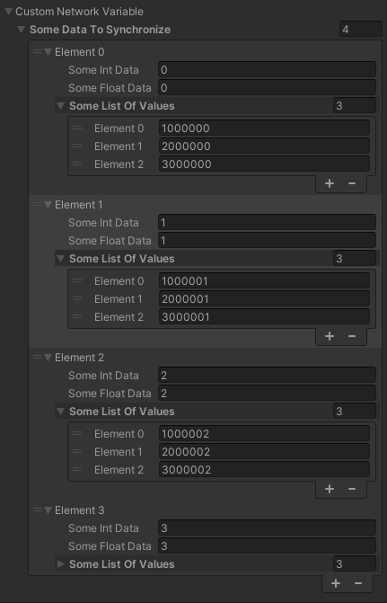

## Introduction
At a high level, a `NetworkVariable` is a way to synchronize a property ("variable") between a server and client(s) without having to use custom messages or RPCs. Since `NetworkVariable` is really a wrapper ("container") of the stored value of type `T`, you must use the `NetworkVariable.Value` property to access the actual value being synchronized. A `NetworkVariable.Value` is synchronized with:
- Newly joining clients (i.e. "Late Joining Clients")
    - When the associated `NetworkObject` of a `NetworkBehaviour`, with `NetworkVariable` properties, is spawned, any `NetworkVariable`'s current state (`Value`) is automatically synchronized on the client side.
- Connected clients
    - When a `NetworkVariable` value changes, any connected clients that subscribed to `NetworkVariable.OnValueChanged` event (prior to the value being changed) will be notified of the change.
        - Two parameters are passed to any `NetworkVariable.OnValueChanged` subscribed callback method:
            - First parameter (Previous): The previous value before the value was changed
            - Second parameter (Current): The newly changed `NetworkVariable.Value`.

### NetworkVariable General Requirements
A `NetworkVariable`:
- Property *must* be defined within a `NetworkBehaviour` derived class attached to a `GameObject`
    - The `GameObject` or a parent `GameObject` **must** also have a `NetworkObject` component attached to it.
- A `NetworkVariable`'s assigned type (`T`) must be [constrained to an unmanaged `Type`](https://docs.microsoft.com/en-us/dotnet/csharp/programming-guide/generics/constraints-on-type-parameters#unmanaged-constraint).

:::important
When a client first connects, it will be synchronized with the current value of the `NetworkVariable`.  Typically, clients should register for `NetworkVariable.OnValueChanged` within the OnNetworkSpawn method.  
*But why?*
A `NetworkBehaviour`'s `Awake` and `Start` methods are invoked based on the type of `NetworkObject` the `NetworkBehaviour` is associated with:   
- In-Scene Placed: Since the instantiation occurs via the scene loading mechanism(s), the `Awake` and `Start` methods are invoked before `OnNetworkSpawn`.
- Dynamically Spawned: Since `OnNetworkSpawn` is invoked immediately (i.e. within the same relative call-stack) after instantiation, `Awake` and `Start` are invoked after `OnNetworkSpawn`.  _Typically, these are invoked at least 1 frame after the `NetworkObject` and associated `NetworkBehaviour` components are instantiated._
:::

:::tip
If you need to initialize other components or objects based on a `NetworkVariable`'s initial synchronized state, then you might contemplate having a common method that is invoked on the client side within the `NetworkVariable.OnValueChanged` callback (if assigned) and `NetworkBehaviour.OnNetworkSpawn` method.
:::

### Synchronization and Notification Example:
The following example demonstrates how the initial `NetworkVariable` synchronization has already occurred by the time `OnNetworkSpawn` is invoked.  It also demonstrates how subscribing to `NetworkVariable.OnValueChanged` within `OnNetworkSpawn` will provide notifications for any changes to `m_SomeValue.Value` that occur.
 ```csharp
public class TestNetworkVariableSynchronization : NetworkBehaviour
{
    private NetworkVariable<int> m_SomeValue = new NetworkVariable<int>();
    private const int k_InitialValue = 1111;

    public override void OnNetworkSpawn()
    {
        if (IsServer)
        {
            m_SomeValue.Value = k_InitialValue;
            NetworkManager.OnClientConnectedCallback += NetworkManager_OnClientConnectedCallback;
        }
        else
        {
            if (m_SomeValue.Value != k_InitialValue)
            {
                Debug.LogWarning($"NetworkVariable was {m_SomeValue.Value} upon being spawned" +
                    $" when it really should have been {k_InitialValue}");
            }
            else
            {
                Debug.Log($"NetworkVariable is {m_SomeValue.Value} when spawned.");
            }
            m_SomeValue.OnValueChanged += OnSomeValueChanged;
        }
    }

    private void NetworkManager_OnClientConnectedCallback(ulong obj)
    {
        StartCoroutine(StartChangingNetworkVariable());
    }

    private void OnSomeValueChanged(int previous, int current)
    {
        Debug.Log($"Detected NetworkVariable Change: Previous: {previous} | Current: {current}");
    }

    private IEnumerator StartChangingNetworkVariable()
    {
        var count = 0;
        var updateFrequency = new WaitForSeconds(0.5f);
        while (count < 4)
        {
            m_SomeValue.Value += m_SomeValue.Value;
            yield return updateFrequency;
        }
        NetworkManager.OnClientConnectedCallback -= NetworkManager_OnClientConnectedCallback;
    }
}
```
In the above example:
 - The server initializes the `NetworkVariable` upon the associated `NetworkObject` being spawned.
 - The client confirms that the `NetworkVariable` is synchronized to the initial value set by the server and assigns a callback method to `NetworkVariable.OnValueChanged`.
   - Once spawned, the client will be notified of any changes made to the `NetworkVariable`.

:::tip
If you were to attach the above script to an in-scene placed `NetworkObject`, make a stand alone build, run the stand alone build as a host, and then connect to that host by entering play mode in the editor, you would see (in the console output):
- The client side `NetworkVariable` value is the same as the server when `NetworkBehaviour.OnNetworkSpawn` is invoked.  
- The client detects any changes made to the `NetworkVariable` after the in-scene placed `NetworkObject` is spawned.  
_This works the same way with dynamically spawned `NetworkObject`s._
:::

:::important
The above example is only to test both the initial client synchronization of the value and when the value changes.  It was intentionally written to only be an example, and if you "late join" a 2nd client it will throw the warning about the `NetworkVariable.Value` not being the initial value.  This example was really intended to be used with a single server or host and a single client.
:::

### OnValueChanged Example:
While the first example highlighted the differences between synchronizing a `NetworkVariable` with newly joining clients and notifying connected clients when a `NetworkVariable` changes, it didn't really provide any concrete example usage.  The next example demonstrates a simple server authoritative `NetworkVariable` being used to track the state of a door (i.e. open or closed):

```csharp
public class Door : NetworkBehaviour
{
    public NetworkVariable<bool> State = new NetworkVariable<bool>();

    public override void OnNetworkSpawn()
    {
        State.OnValueChanged += OnStateChanged;
    }

    public override void OnNetworkDespawn()
    {
        State.OnValueChanged -= OnStateChanged;
    }

    public void OnStateChanged(bool previous, bool current)
    {
        // note: `State.Value` will be equal to `current` here
        if (State.Value)
        {
            // door is open:
            //  - rotate door transform
            //  - play animations, sound etc.
        }
        else
        {
            // door is closed:
            //  - rotate door transform
            //  - play animations, sound etc.
        }
    }

    [ServerRpc(RequireOwnership = false)]
    public void ToggleServerRpc()
    {
        // this will cause a replication over the network
        // and ultimately invoke `OnValueChanged` on receivers
        State.Value = !State.Value;
    }
}
```
In the above example, we demonstrate how you can maintain a server authoritative `NetworkVariable` by using a non-ownership based server RPC (i.e. `RequireOwnership = false` means non-owners can invoke it) so any client can notify the server that it is performing an "action" on the door. For this example, each time the door is used by a client the `Door.ToggleServerRpc` is invoked and the server-side toggles the state of the door. Upon the `Door.State.Value` changing, all connected clients are synchronized to the (new) current `Value` and the `OnStateChanged` method is invoked locally on each client.

However, what if you wanted to adjust who could write to or read from the `NetworkVariable`?<br/> _The answer: `NetworkVariable` permissions._

## Permissions
The `NetworkVariable` constructor can take up to 3 parameters:
```csharp
public NetworkVariable(T value = default, 
NetworkVariableReadPermission readPerm = NetworkVariableReadPermission.Everyone, 
NetworkVariableWritePermission writePerm = NetworkVariableWritePermission.Server);
```
As you can see by the above constructor declaration, the default permissions are:
- *Server:* Has read and write permissions
- *Clients:* Have read only permissions.

Let's look at the two types of permissions defined within [NetworkVariablePermissions.cs](https://github.com/Unity-Technologies/com.unity.netcode.gameobjects/blob/release/1.0.0/com.unity.netcode.gameobjects/Runtime/NetworkVariable/NetworkVariablePermission.cs):

```csharp
    /// <summary>
    /// The permission types for reading a var
    /// </summary>
    public enum NetworkVariableReadPermission
    {
        /// <summary>
        /// Everyone can read
        /// </summary>
        Everyone,
        /// <summary>
        /// Only the owner and the server can read
        /// </summary>
        Owner,
    }

    /// <summary>
    ///  The permission types for writing a var
    /// </summary>
    public enum NetworkVariableWritePermission
    {
        /// <summary>
        /// Only the server can write
        /// </summary>
        Server,
        /// <summary>
        /// Only the owner can write
        /// </summary>
        Owner
    }
```
:::important
Since Netcode for GameObjects uses a server authoritative model, the server will always have read or write permissions to any `NetworkVariable`.  As an example, if you set both the read and write permissions to `Owner` the server can still read and write to the `NetworkVariable`.
:::

### Read Permissions
There are two options for reading a `NetworkVariable.Value`:
- *Everyone(_default_):* this means the owner and non-owners of the `NetworkObject` can read the value.
    - This is useful for "global states" that everyone should be aware of.  
    - We provided an example of maintaining a door's open or closed state using the everyone permission.
        - You might also use this for player scores, health, or any other state that "everyone" should know about.
- *Owner:* This means only the owner of the `NetworkObject` and the server can read the value.
    - This is useful if your `NetworkVariable` represents something specific to the client's player that only the server and client should know about
        - This might be a player's inventory or gun's ammo count (etc.)

### Write Permissions
There are two options for writing a `NetworkVariable.Value`:
- *Server(_default_):* the server is the only one that can write the value.
    - This is useful for server side specific states that all clients should should be aware of but cannot change.
        - Some examples would be an NPC's status (health, alive, dead, etc) or some global world environment state (i.e. is it night or day time?).
- *Owner:* This means only the owner of the `NetworkObject` and the server can write to the value.
    - This is useful if your `NetworkVariable` represents something specific to the client's player that only the server and client should know about
        - This might be a player's inventory or gun's ammo count (etc.)

### Permissions Example
The below example provides you with a few different permissions configurations that you might use in a game while keeping track of a player's state. 
```csharp
public class PlayerState : NetworkBehaviour
{
    private const float k_DefaultHealth = 100.0f;
    /// <summary>
    /// Default Permissions: Everyone can read, server can only write
    /// Player health is typically something determined (updated/written to) on the server
    ///  side, but a value everyone should be synchronized with (i.e. read permissions).
    /// </summary>
    public NetworkVariable<float> Health = new NetworkVariable<float>(k_DefaultHealth);

    /// <summary>
    /// Owner Read & Write Permissions: Owner or server can read and write
    /// A player's ammo count is something that you might want, for convenience sake, the
    /// client-side to update locally. This might be because you are trying to reduce 
    /// bandwidth consumption for the server and all non-owners/ players or you might be 
    /// trying to incorporate a more client-side "hack resistant" design where non-owners 
    /// are never synchronized with this value.
    /// </summary>
    public NetworkVariable<int> AmmoCount = new NetworkVariable<int>(default, 
        NetworkVariableReadPermission.Owner, NetworkVariableWritePermission.Owner);

    /// <summary>
    /// Owner Write & Everyone Read Permissions:
    /// A player's model's skin selection index. You might have the option to allow players
    /// to select different skin materials as a way to further encourage a player's personal
    /// association with their player character.  It would make sense to make the permissions 
    /// setting of the NetworkVariable such that the client can change the value, but everyone 
    /// will be notified when it changes to visually reflect the new skin selection.
    /// </summary>
    public NetworkVariable<int> SkinSelectionIndex = new NetworkVariable<int>(default,
        NetworkVariableReadPermission.Everyone, NetworkVariableWritePermission.Owner);

    /// <summary>
    /// Owner Read & Server Write Permissions:
    /// You might incorporate some form of reconnection logic that stores a player's state on 
    /// the server side and can be used by the client to reconnect a player if disconnected
    /// unexpectedly.  In order for the client to let the server know it is the "same client" 
    /// you might have implemented a keyed array (i.e. Hashtable, Dictionary, etc, ) to track
    /// each connected client. The key value for each connected client would only be written to
    /// the each client's PlayerState.ReconnectionKey. Under this scenario, you only want the 
    /// server to have write permissions and the owner (client) to be synchronized with this 
    /// value (via owner only read permissions).
    /// </summary>
    public NetworkVariable<ulong> ReconnectionKey = new NetworkVariable<ulong>(default,
    NetworkVariableReadPermission.Owner, NetworkVariableWritePermission.Server);
}
```
The above example provides you with details on:
- The `NetworkVariable`'s purpose.
- The "logical" reasoning behind each `NetworkVariable`'s read and write permission settings.

:::important
You might be wondering about our earlier door example and why we chose to use a server RPC for clients to notify the server that the door's open/closed state has changed.  Under that scenario, the owner of the door will most likely be owned by the server just like non-player characters will almost always be owned by the server.  Under a server owned scenario, using an RPC to handle updating a `NetworkVariable` is the proper choice above permissions for most cases.
:::

## Complex Value Types 
Almost all of our examples have been focused around numeric [Value Types](https://docs.microsoft.com/en-us/dotnet/csharp/language-reference/builtin-types/value-types). Value types are any `Type` that cannot be assigned a null value. Structures are considered non-nullable complex value types. From a Netcode for GameObject perspective, as long as the structure (or any nested sub-property) does not contain any properties that are considered nullable value types.

:::warning
`NetworkVariable` does not support any [nullable value types](https://docs.microsoft.com/en-us/dotnet/csharp/language-reference/builtin-types/nullable-value-types).  This includes any `INetworkSerializable` implementation that contains any properties (private, protected, internal, and public) that are of a nullable value type. You can use INetworkSerializable implementations that contain
:::

### Synchronizing Complex Types Example:
For this example, we are extending the previous `PlayerState` class to include some complex value types to handle a weapon boosting game play mechanic.  We will explore two complex values types:
- *WeaponBooster:* A power-up weapon booster that can only be assigned/applied by the client.
    - This is a simple example of a "complex" value type.
- *AreaWeaponBooster:* A second kind of "weapon booster" power-up that players can deploy at a specific location, and any team members within the radius of the `AreaWeaponBooster` will have the weapon booster applied.
    - This is an example of a nested complex value type.

For the `WeaponBooster`, we only need one NetworkVariable to handle synchronizing everyone with any currently active player-local `WeaponBooster`. However, with the `AreaWeaponBooster` we must consider what happens if you have 8 team members that could, at any given moment, deploy one a `AreaWeaponBooster`?  It would require, at a minimum, a list of all deployed and currently active `AreaWeaponBooster`s.  For this task, we will use a `NetworkList` as opposed to a `NetworkVariable`.

First, let's review over the below `PlayerState` additions along with the `WeaponBooster` structure (complex value type):

```csharp
public class PlayerState : NetworkBehaviour
{
    // ^^^^^^^ including all code from previous example ^^^^^^^

    // The weapon booster currently applied to a player
    private NetworkVariable<WeaponBooster> PlayerWeaponBooster = new NetworkVariable<WeaponBooster>();

    // A list of team members active "area weapon boosters" that could be applied if the local player
    // is within their range.
    private NetworkList<AreaWeaponBooster> TeamAreaWeaponBoosters = new NetworkList<AreaWeaponBooster>();
}

/// <summary>
/// Example: Complex Value Type
/// This is an example of how one might handle tracking any weapon booster currently applied
/// to a player. 
/// </summary>
public struct WeaponBooster : INetworkSerializable, System.IEquatable<WeaponBooster>
{
    public float PowerAmplifier;
    public float Duration;

    public void NetworkSerialize<T>(BufferSerializer<T> serializer) where T : IReaderWriter
    {
        if (serializer.IsReader)
        {
            var reader = serializer.GetFastBufferReader();
            reader.ReadValueSafe(out PowerAmplifier);
            reader.ReadValueSafe(out Duration);
        }
        else
        {
            var writer = serializer.GetFastBufferWriter();
            writer.WriteValueSafe(PowerAmplifier);
            writer.WriteValueSafe(Duration);
        }
    }

    public bool Equals(WeaponBooster other)
    {
        return PowerAmplifier == other.PowerAmplifier && Duration == other.Duration;
    }
}
```
The above first half of the example code shows how a complex value type that implements `INetworkSerializable` is pretty straight forward. Looking at the below second portion of our example, we can see that the `AreaWeaponBooster` includes a `WeaponBooster` property that would (for example) be applied to team members that are within the `AreaWeaponBoosters` radius: 

```csharp
/// <summary>
/// Example: Nesting Complex Value Types
/// This example uses the previous WeaponBooster complex value type to be a "container" for
/// the "weapon booster" information of an AreaWeaponBooster.  It then provides additional
/// information that would allow clients to easily determine, based on location and radius,
/// if it should add (for example) a special power up HUD symbol or special-FX to the local 
/// player.
/// </summary>
public struct AreaWeaponBooster : INetworkSerializable, System.IEquatable<AreaWeaponBooster>
{
    public WeaponBooster ApplyWeaponBooster; // the nested complex value type
    public float Radius;
    public Vector3 Location;
    public void NetworkSerialize<T>(BufferSerializer<T> serializer) where T : IReaderWriter
    {
        if (serializer.IsReader)
        {
            // The complex value type handles its own de-serialization
            serializer.SerializeValue(ref ApplyWeaponBooster);
            // Now de-serialize the non-complex value type properties
            var reader = serializer.GetFastBufferReader();
            reader.ReadValueSafe(out Radius);
            reader.ReadValueSafe(out Location);
        }
        else
        {
            // The complex value type handles its own serialization
            serializer.SerializeValue(ref ApplyWeaponBooster);
            // Now serialize the non-complex value type properties
            var writer = serializer.GetFastBufferWriter();
            writer.WriteValueSafe(Radius);
            writer.WriteValueSafe(Location);
        }
    }

    public bool Equals(AreaWeaponBooster other)
    {
        return other.Equals(this) && Radius == other.Radius && Location == other.Location;
    }
}
```
 Looking closely at the read and write segments of code within `AreaWeaponBooster.NetworkSerialize`, the nested complex value type property `ApplyWeaponBooster` handles its own serialization and de-serialization. Any `AreaWeaponBooster` value type property is serialized and de-serialized by the `ApplyWeaponBooster`'s implemented `NetworkSerialize` method. Using this type of design approach can help reduce code replication while providing a more modular foundation to build even more complex, nested, value types.

## Custom NetworkVariable Implementations
:::warning Disclaimer
The `NetworkVariable` and `NetworkList` classes were created as `NetworkVariableBase` class implementation examples. While the `NetworkVariable<T>` class is considered production ready for basic `unmanaged` value types, you might run into scenarios where you have a more advanced implementation in mind.  Under this scenario, we would encourage you to create your own custom implementation.
:::
In order to create your own `NetworkVariableBase` derived container, you should:
- Create a class deriving from `NetworkVariableBase`.
- Assure the the following methods are overridden:
    - `void WriteField(FastBufferWriter writer)`
    - `void ReadField(FastBufferReader reader)`
    - `void WriteDelta(FastBufferWriter writer)`
    - `void ReadDelta(FastBufferReader reader, bool keepDirtyDelta)`
- Depdending upon your custom `NetworkVariableBase` container, you might look at `NetworkVariable<T>` or `NetworkList` to see how those two examples were implemented.
 
 ### Custom NetworkVariable Example:
 With all of the previous discussion revolving around (unmanaged) value types, this example will explore a custom `NetworkVariableBase` derived class that does contain managed properties and one way (for example purposes) that you can have a mixture of managed and unmanaged value types:
 ```csharp
    /// Using MyCustomNetworkVariable within a NetworkBehaviour
    public class TestMyCustomNetworkVariable : NetworkBehaviour
    {
        public MyCustomNetworkVariable CustomNetworkVariable = new MyCustomNetworkVariable();
        public override void OnNetworkSpawn()
        {
            if (IsServer)
            {
                for (int i = 0; i < 4; i++)
                {
                    var someData = new SomeData();
                    someData.SomeFloatData = (float)i;
                    someData.SomeIntData = i;
                    someData.SomeListOfValues.Add((ulong)i + 1000000);
                    someData.SomeListOfValues.Add((ulong)i + 2000000);
                    someData.SomeListOfValues.Add((ulong)i + 3000000);
                    CustomNetworkVariable.SomeDataToSynchronize.Add(someData);
                    CustomNetworkVariable.SetDirty(true);
                }
            }
        }
    }

    /// Bare minimum example of NetworkVariableBase derived class
    [Serializable]
    public class MyCustomNetworkVariable : NetworkVariableBase
    {
        /// Managed list of class instances
        public List<SomeData> SomeDataToSynchronize = new List<SomeData>();

        /// <summary>
        /// Writes the complete state of the variable to the writer
        /// </summary>
        /// <param name="writer">The stream to write the state to</param>
        public override void WriteField(FastBufferWriter writer)
        {
            // Serialize the data we need to synchronize
            writer.WriteValueSafe(SomeDataToSynchronize.Count);
            foreach (var dataEntry in SomeDataToSynchronize)
            {
                writer.WriteValueSafe(dataEntry.SomeIntData);
                writer.WriteValueSafe(dataEntry.SomeFloatData);
                writer.WriteValueSafe(dataEntry.SomeListOfValues.Count);
                foreach (var valueItem in dataEntry.SomeListOfValues)
                {
                    writer.WriteValueSafe(valueItem);
                }
            }
        }

        /// <summary>
        /// Reads the complete state from the reader and applies it
        /// </summary>
        /// <param name="reader">The stream to read the state from</param>
        public override void ReadField(FastBufferReader reader)
        {
            // De-Serialize the data being synchronized
            var itemsToUpdate = (int)0;
            reader.ReadValueSafe(out itemsToUpdate);
            SomeDataToSynchronize.Clear();
            for (int i = 0; i < itemsToUpdate; i++)
            {
                var newEntry = new SomeData();
                reader.ReadValueSafe(out newEntry.SomeIntData);
                reader.ReadValueSafe(out newEntry.SomeFloatData);
                var itemsCount = (int)0;
                var tempValue = (ulong)0;
                reader.ReadValueSafe(out itemsCount);
                newEntry.SomeListOfValues.Clear();
                for (int j = 0; j < itemsCount; j++)
                {
                    reader.ReadValueSafe(out tempValue);
                    newEntry.SomeListOfValues.Add(tempValue);
                }
                SomeDataToSynchronize.Add(newEntry);
            }
        }

        public override void ReadDelta(FastBufferReader reader, bool keepDirtyDelta)
        {
            // Do nothing for this example
        }

        public override void WriteDelta(FastBufferWriter writer)
        {
            // Do nothing for this example
        }
    }    

    /// Example managed class used as the item type in the 
    /// MyCustomNetworkVariable.SomeDataToSynchronize list
    [Serializable]
    public class SomeData
    {
        public int SomeIntData = default;
        public float SomeFloatData = default;
        public List<ulong> SomeListOfValues = new List<ulong>();
    }
 ```
While the above example is not the "recommended" way to synchronize a list that frequently changes (i.e. one or more elements position/order or add/remove), it is just an example of how you can "define your own rules" through using `NetworkVariableBase`.  Whether you handle managed or unmanaged value types is up to you.

The above code could be tested by:
- Using the above code with a project that includes Netcode for GameObjects v1.0 (or higher).
- Adding the `TestMyCustomNetworkVariable` component to an in-scene placed `NetworkObject`.
- Creating a stand alone build and running that as a host or server
- Running the same scene within the editor and connecting as a client
    - Once connected, you can then select the `GameObject` with the attached `NetworkObject` and `TestMyCustomNetworkVariable` components so it appears in the inspector view.  There you can verify the `TestMyCustomNetworkVariable.CustomNetworkVariable` property was synchronized with the client (like in the screenshot below):<br/>
    <br/>

:::caution
If you are not adhering to the (unmanaged) value types in your own custom `NetworkVariableBase` implementation then it is advised to not try and use `NetworkList` or `NetworkVariable` as properties within that implementation. Instead, declare `NetworkVariable` or `NetworkList` properties within the same `NetworkBehaviour` that you have declared your custom `NetworkVariableBase` implementation within.
:::
