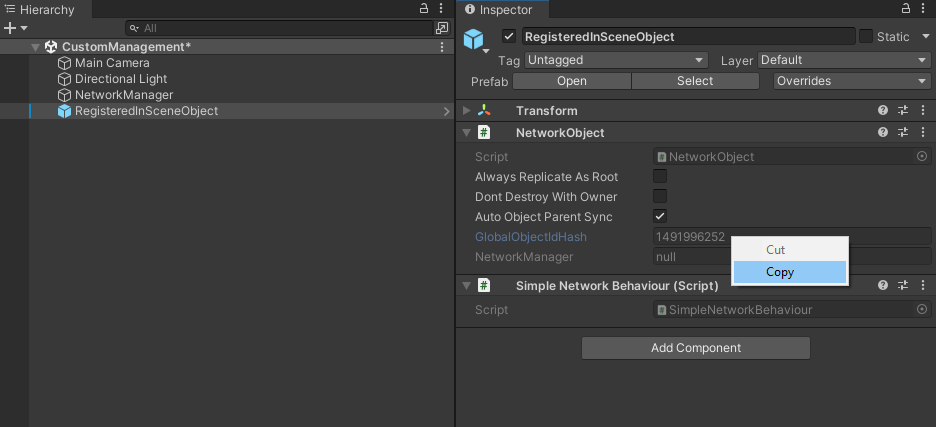
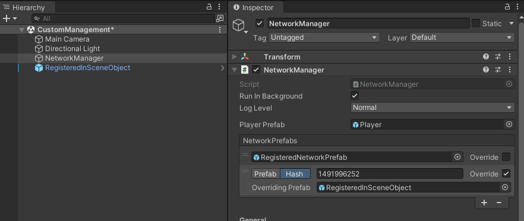

:::caution
If you have not already read the [Using NetworkSceneManager](using-networkscenemanager.md) section, it is highly recommended to do so before proceeding.
Custom Scene Management currently has some drawbacks that we hope to improve upon over time.
:::

## Building Your Own Scene Management Solution
Netcode for GameObjects has primarily focused on providing a scene management solution that should meet most projects' needs. However, there might be a special case scenario where you require building your own scene management solution. The very first step is to disable the "Enable Scene Management" property in your `NetworkManager`'s properties. All of your scene loading and unloading will be handled via the UnityEngine.SceneManagement.SceneManager class.  

### Registering In-Scene Placed NetworkObjects
While integrated scene management solution handles the synchronization of in-scene placed `NetworkObject`s, custom scene management treats everything like a dynamically spawned `NetworkObject`.  As such, you are **required to register a Network Prefab hash override for each in-scene placed `NetworkObject` instance**.

**In-Scene Placed `NetworkObject` Registration Steps:**
- [See "Creating In-Scene Placed Network Prefab Instances"](inscene-placed-networkobjects#creating-in-scene-placed-network-prefab-instances) as a reference for creating in-scene placed Network Prefabs.
- Create an instance of a Network Prefab in your scene.
- Select the instance and in the inspector view navigate to the `NetworkObject` component
  - Copy the GlobalObjectIdHash value of the `NetworkObject`
  
- Within your `NetworkManager`, create a new Network Prefab entry in the Network Prefabs list.
  - Check the "Override" property of the new Network Prefab entry.
  - Select "Hash" and paste the GlobalObjectIdHash value into the "Hash" field.
  - Drag an drop your recently created in-scene placed Network Prefab to link the two together (GlobalObjectIdHash and Network Prefab)
  
:::tip
If your `NetworkManager` is in another scene, then the easiest way to accomplish this is to (within the editor) load the scene containing the `NetworkManager` instance and the scene you are creating an instance of your in-scene placed Network Prefab.  Having quick access to your `NetworkManager`'s properties helps expedite the in-scene placed Network Prefab override registration process.
:::

Once you have registered your in-scene placed Network Prefab instances with the `NetworkManager`, you can then start a server/host and have a client connect and synchronize with the in-scene placed Network Prefab instances (as long as both client and server have pre-loaded the scene or scenes required).  Due to the complexity of in-scene placed Network Prefab registration, we highly recommend using in-scene placed `NetworkObject`s sparingly and [use the Hybrid approach](inscene-placed-networkobjects#a-hybrid-approach-example) as much as possible. 

:::important
When a client first connects, it will delete any in-scene placed `NetworkObjects` in any of the scenes it has currently loaded.  When using a custom scene management solution, In-scene placed `NetworkObject`s are actually dynamically spawned.  While registering in-scene placed Network Prefabs does require more initial setup, it also removes many of the integrated scene management restraints.  As your custom scene management solution starts to take shape, you can devise your own rules for in-scene placed Network Prefab instances (if any).
:::

## Starting a Netcode Enabled Game Session
The recommended way of starting session using your own scene management solution is to assure that when a client attempts to join a netcode game session it should already have (as best as possible) any scenes that the server might have loaded.  While this does not assure that your newly connecting client will load any additional scenes that might have been loaded, using this approach initially will get you started so you can then come up with a strategy to handling:
- Scene Synchronization
- Scene Loading and Unloading

### Scene synchronization
 While you might have an initial set of scenes loaded, you are bound to want to load more scenes as your netcode enabled game session progresses.  Once a client has fully connected (you can use `NetworkManager.OnClientConnected` for this), you will want to send the client a list of additional scenes to be loaded.
  - You will want to come up with your own "client state" as it progresses through this synchronization process to determine when a client has loaded all scenes.  
    - As an example:  A client might be connected and has synchronized with the default scenes required to connect, but then you have one or more additional scenes you might have loaded (additively) that the client needs to load and synchronize (spawn) any in-scene placed Network Prefab instances 

### Scene Loading and Unloading
You can accomplish this using either RPCs or custom messages. You might even use your own `INetworkSerializable` implementation that contains a list of scenes and whether they should be loaded or unloaded.  You should always have some form of "complete" response factored into your design so you know when a client has finished loading/unloading a scene. You will also want to devise a strategy for loading a scene in `LoadSceneMode.Additive` and `LoadSceneMode.Single` modes.  

:::tip
Creating a global scene management script and attaching it to the same GameObject as the `NetworkManager` is one way to assure your custom netcode scene management solution persists while a game session is in progress.  
:::

