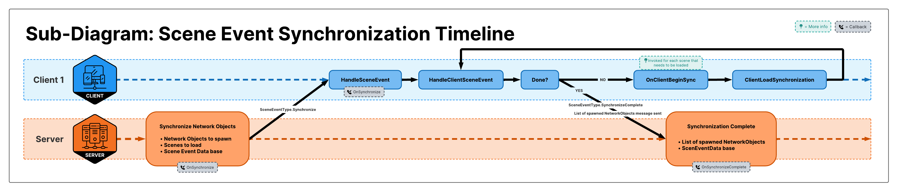
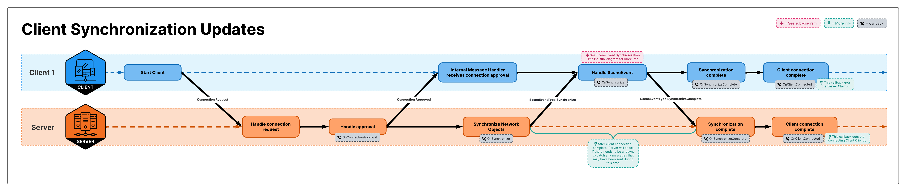
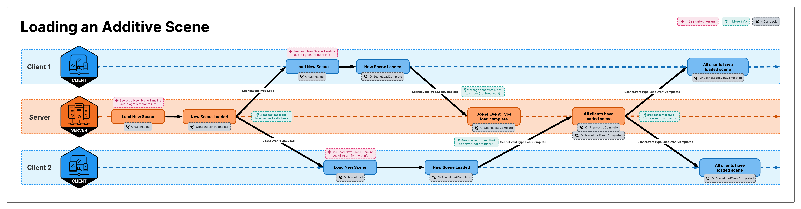
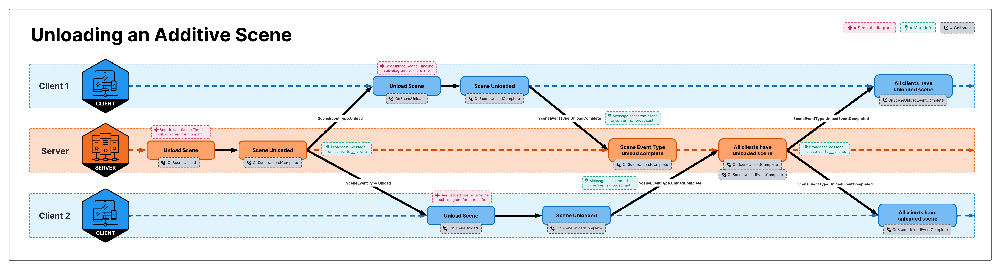
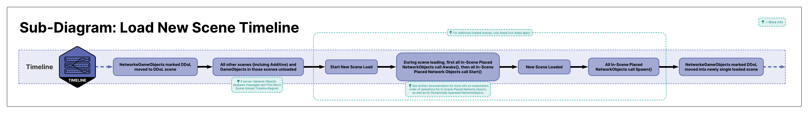
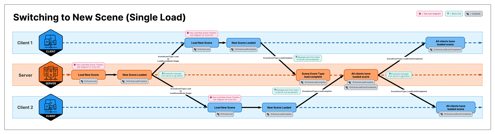
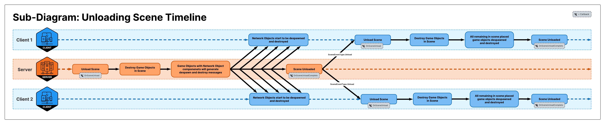

## Scene Management Timing (WIP)

Scene Event Synchronization:  

Client Synchronization Updates:  

Loading Scenes Additively (`SceneLoadMode.Additive`):  

Unloading Additively Loaded Scenes:  
 

Switching Scenes (`SceneLoadMode.Single`):  

Unloading Scenes Timeline:  

