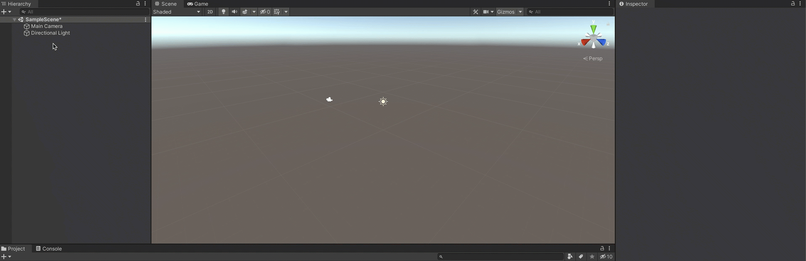
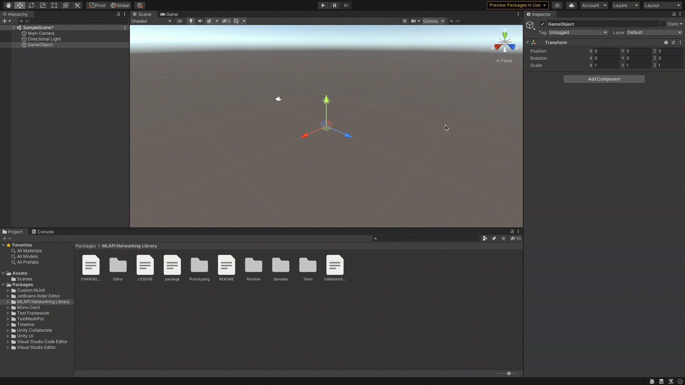
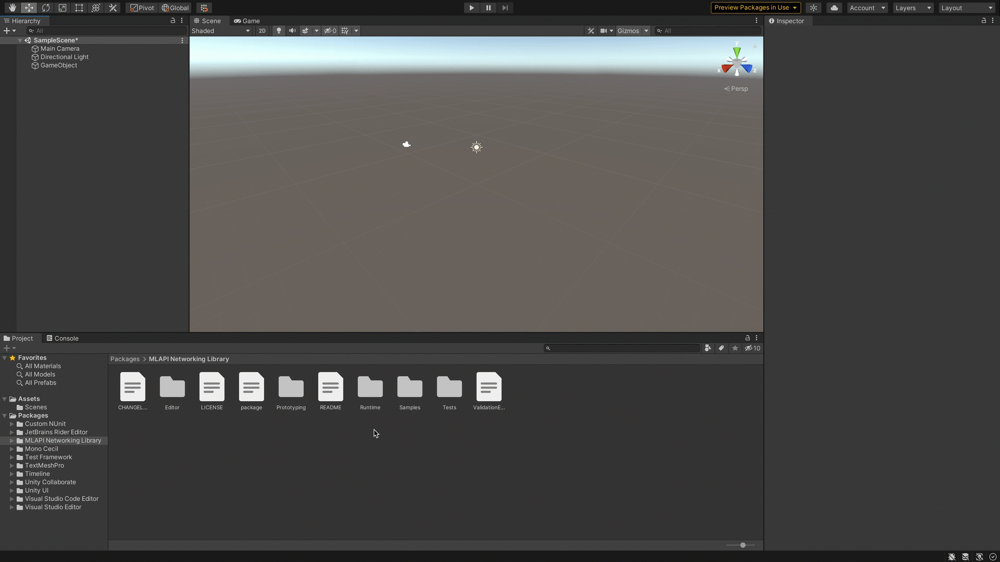
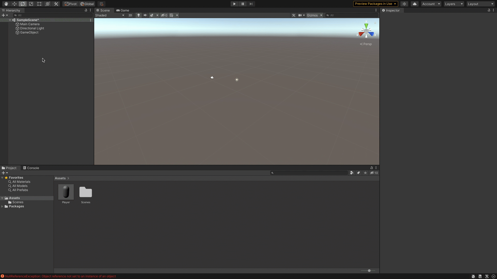

:::important

This tutorial requires an MLAPI-supported version of Unity (2019.4+)

:::

## Import Package via URL

1. Open the package manager by navigating to Window > Package Manager on Unity’s main menu.
1. Click  in the status bar.

    the following options are displayed

     - Add package from disk...
     - Add package from tarball...
     - Add package from git URL...

1. Select '**Add** package from git URL...'  
1. Enter the Git URL https://github.com/Unity-Technologies/com.unity.multiplayer.mlapi.git?path=/com.unity.multiplayer.mlapi#develop
1. Click **Add**
   
    

You have now installed MLAPI

## Create the Basic Components.

1. Right Click in the Hierarchy tab of the Main Unity Window
1. Select Create Empty
   
     

You have now created a new empty GameObject.

:::tip 
You could rename this object to give it a more relevant name but for the purpose of this guide its not required.
::: 

1. Select the new Gameobject
1. Click **Add Component** in the Inspector Tab
1. Select MLAPI from the list shown
1. Select NetworkingManager Component from the list displayed.
1. Inside the NetworkingManger component tab,
1. Locate the  NetworkTransport field. 
1. click "Select Transport" 
1. Select UnetTransport.

    

1. Create 3D Object->Capsule (name it Player). 
2. Add a NetworkedObject component.
3. Make this Player scene object a prefab.

    
4. Delete Player in scene.
5. Add Player prefab to NetworkedPrefabs list inside of NetworkingManger 
6. tick "Default Player Prefab".

    
7. Inside scene, create a Plane GameObject, centered at (0,0,0).
8. Click Play
9. Click "Start Host" under NetworkingManager 

    

:::funfact
Congratulations you have created a networked game.  It is not a very flashy game  but it's a networked game nonetheless.
:::