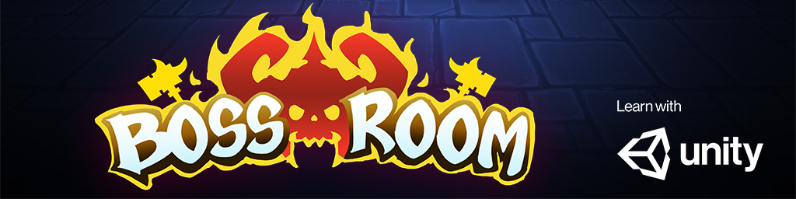
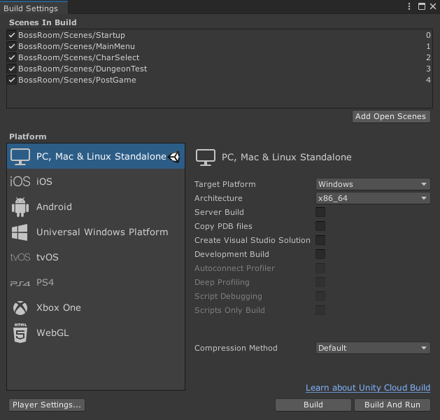

# BossRoom - Multiplayer Samples Co-op built with Unity MLAPI

:::important
This project is currently experimental.
:::

BossRoom is a fully functional Multiplayer Samples Co-op made in Unity and MLAPI. It is built to serve as an educational sample that showcases certain typical gameplay patterns that are frequently featured in similar games.

The intention is that you can use everything in this project as a starting point or as bits and pieces in your own Unity games. 

## To get the project
 - A release version can be downloaded from the [Releases](https://github.com/Unity-Technologies/com.unity.multiplayer.samples.coop/releases) page. 
 - Unzip the archive file.
 - You are now ready to add the project to Unity Hub.

:::important Compatability
- The MLAPI supports all major Unity platforms. To use the WebGL platform a custom WebGL transport based on web sockets is needed.
- MLAPI is compatible with Unity 2019 and newer versions.
- Make sure to include standalone support for Windows/Mac in your installation. 
:::

## To add the project with Unity Hub
1. Open Unity Hub.
1. Click **Add**..
1. Select the root folder of the downloaded project.

:::note
The first time you open the project Unity will import all assets, which will take longer than usual - it is normal.
:::

## To open the project for the first time

Once the editor is ready, 
1. Navigate to the _Project_ window 
1. Open the _Project/Startup_ scene.
1. Click  **Play**

## Testing multiplayer

In order to see the multiplayer functionality in action we can either run multiple instances of the game locally on our computer or choose to connect to a friend over the internet.

---------------
### Local multiplayer setup

#### Build an Excutable.

Click  _File/Build Settings_ 
Click **Build**.

After the build has completed you can launch several instances of the built executable to be able to both host and join a game.

:::important Mac Users
To run multiple instances of the same app, you need to use the command line.
> Run `open -n BossRoom.app`
:::

### Multiplayer over internet

:::tip
In contrast to running a local setup, when playing over internet we don't neccessarily need a built executable. We can just run the game in editor.
:::

Running the game over internet currently requires setting up a Photon Transport for MLAPI, which uses Photon relay server to facilitate communication between clients and server living on different networks.

Alternatively you can use Port Forwarding. The wonderful https://portforward.com/ site has guides on how to enable port forwarding on a huge number of routers. BossRoom uses UDP and needs a 9998 external port to be open.

