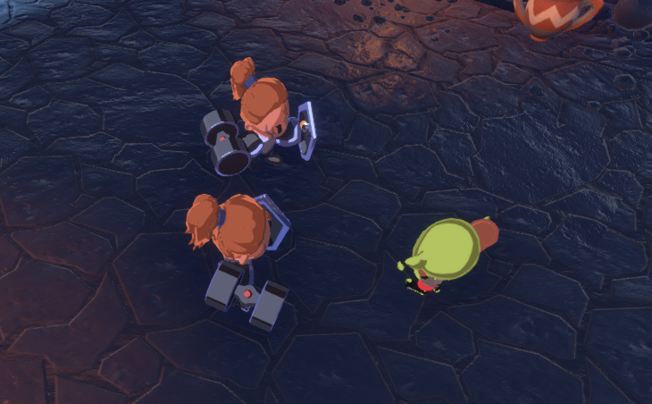

This page contains examples of how `RPC`s or `NetworkVariable`s have been used in the Small Coop Sample (Boss Room Project.) It should provide some guidance on when to use `RPC`s or `NetworkVariable`s in your own projects.


## RPCs for movement
Boss Room uses RPCs to send movement inputs.

<!---```csharp reference
https://github.com/Unity-Technologies/com.unity.multiplayer.samples.coop/blob/develop/Assets/BossRoom/Scripts/Client/Game/Character/ClientInputSender.cs
 --->
```csharp 
using MLAPI;
using System;
using System.Collections.Generic;
using MLAPI.Spawning;
using UnityEngine;
using UnityEngine.Assertions;
using UnityEngine.EventSystems;

namespace BossRoom.Client
{
    /// <summary>
    /// Captures inputs for a character on a client and sends them to the server.
    /// </summary>
    [RequireComponent(typeof(NetworkCharacterState))]
    public class ClientInputSender : NetworkBehaviour
    {
        private const float k_MouseInputRaycastDistance = 100f;

        private const float k_MoveSendRateSeconds = 0.5f;

        private float m_LastSentMove;

        // Cache raycast hit array so that we can use non alloc raycasts
        private readonly RaycastHit[] k_CachedHit = new RaycastHit[4];

        // This is basically a constant but layer masks cannot be created in the constructor, that's why it's assigned int Awake.
        private LayerMask k_GroundLayerMask;
        private LayerMask k_ActionLayerMask;

        private NetworkCharacterState m_NetworkCharacter;

        /// <summary>
        /// This describes how a skill was requested. Skills requested via mouse click will do raycasts to determine their target; skills requested
        /// in other matters will use the stateful target stored in NetworkCharacterState.
        /// </summary>
        public enum SkillTriggerStyle
        {
            None,        //no skill was triggered.
            MouseClick,  //skill was triggered via mouse-click implying you should do a raycast from the mouse position to find a target.
            Keyboard,    //skill was triggered via a Keyboard press, implying target should be taken from the active target.
            KeyboardRelease, //represents a released key.
            UI,          //skill was triggered from the UI, and similar to Keyboard, target should be inferred from the active target.
        }

        /// <summary>
        /// This struct essentially relays the call params of RequestAction to FixedUpdate. Recall that we may need to do raycasts
        /// as part of doing the action, and raycasts done outside of FixedUpdate can give inconsistent results (otherwise we would
        /// just expose PerformAction as a public method, and let it be called in whatever scoped it liked.
        /// </summary>
        /// <remarks>
        /// Reference: https://answers.unity.com/questions/1141633/why-does-fixedupdate-work-when-update-doesnt.html
        /// </remarks>
        private struct ActionRequest
        {
            public SkillTriggerStyle TriggerStyle;
            public ActionType RequestedAction;
            public ulong TargetId;
        }

        /// <summary>
        /// List of ActionRequests that have been received since the last FixedUpdate ran. This is a static array, to avoid allocs, and
        /// because we don't really want to let this list grow indefinitely.
        /// </summary>
        private readonly ActionRequest[] m_ActionRequests = new ActionRequest[5];

        /// <summary>
        /// Number of ActionRequests that have been queued since the last FixedUpdate.
        /// </summary>
        private int m_ActionRequestCount;

        private BaseActionInput m_CurrentSkillInput = null;
        private bool m_MoveRequest = false;


        Camera m_MainCamera;

        public event Action<Vector3> OnClientClick;

        /// <summary>
        /// Convenience getter that returns our CharacterData
        /// </summary>
        CharacterClass CharacterData => GameDataSource.Instance.CharacterDataByType[m_NetworkCharacter.CharacterType];

        public override void NetworkStart()
        {
            // TODO Don't use NetworkBehaviour for just NetworkStart [GOMPS-81]
            if (!IsClient || !IsOwner)
            {
                enabled = false;
                // dont need to do anything else if not the owner
                return;
            }

            k_GroundLayerMask = LayerMask.GetMask(new[] { "Ground" });
            k_ActionLayerMask = LayerMask.GetMask(new[] { "PCs", "NPCs", "Ground" });

            // find the hero action UI bar
            GameObject actionUIobj = GameObject.FindGameObjectWithTag("HeroActionBar");
            actionUIobj.GetComponent<Visual.HeroActionBar>().RegisterInputSender(this);

            // find the emote bar to track its buttons
            GameObject emoteUIobj = GameObject.FindGameObjectWithTag("HeroEmoteBar");
            emoteUIobj.GetComponent<Visual.HeroEmoteBar>().RegisterInputSender(this);
            // once connected to the emote bar, hide it
            emoteUIobj.SetActive(false);
        }

        void Awake()
        {
            m_NetworkCharacter = GetComponent<NetworkCharacterState>();
            m_MainCamera = Camera.main;
        }

        public void FinishSkill()
        {
            m_CurrentSkillInput = null;
        }

        void FixedUpdate()
        {
            //play all ActionRequests, in FIFO order.
            for (int i = 0; i < m_ActionRequestCount; ++i)
            {
                if( m_CurrentSkillInput != null )
                {
                    //actions requested while input is active are discarded, except for "Release" requests, which go through.
                    if (m_ActionRequests[i].TriggerStyle == SkillTriggerStyle.KeyboardRelease )
                    {
                        m_CurrentSkillInput.OnReleaseKey();
                    }
                }
                else
                {
                    var actionData = GameDataSource.Instance.ActionDataByType[m_ActionRequests[i].RequestedAction];
                    if (actionData.ActionInput != null)
                    {
                        var skillPlayer = Instantiate(actionData.ActionInput);
                        skillPlayer.Initiate(m_NetworkCharacter, actionData.ActionTypeEnum, FinishSkill);
                        m_CurrentSkillInput = skillPlayer;
                    }
                    else
                    {
                        PerformSkill(actionData.ActionTypeEnum, m_ActionRequests[i].TriggerStyle, m_ActionRequests[i].TargetId);
                    }
                }
            }

            m_ActionRequestCount = 0;

            if( m_MoveRequest )
            {
                m_MoveRequest = false;
                if ( (Time.time - m_LastSentMove) > k_MoveSendRateSeconds)
                {
                    m_LastSentMove = Time.time;
                    var ray = m_MainCamera.ScreenPointToRay(Input.mousePosition);
                    if (Physics.RaycastNonAlloc(ray, k_CachedHit, k_MouseInputRaycastDistance, k_GroundLayerMask) > 0)
                    {
                    // The MLAPI_INTERNAL channel is a reliable sequenced channel. Inputs should always arrive and be in order that's why this channel is used.
                    m_NetworkCharacter.SendCharacterInputServerRpc(k_CachedHit[0].point);
                        //Send our client only click request
                        OnClientClick?.Invoke(k_CachedHit[0].point);
                    }
                }
            }
        }

        /// <summary>
        /// Perform a skill in response to some input trigger. This is the common method to which all input-driven skill plays funnel.
        /// </summary>
        /// <param name="actionType">The action you want to play. Note that "Skill1" may be overriden contextually depending on the target.</param>
        /// <param name="triggerStyle">What sort of input triggered this skill?</param>
        /// <param name="targetId">(optional) Pass in a specific networkID to target for this action</param>
        private void PerformSkill(ActionType actionType, SkillTriggerStyle triggerStyle, ulong targetId = 0)
        {
            Transform hitTransform = null;
            
            if (targetId != 0)
            {
                // if a targetId is given, try to find the object
                NetworkObject targetNetObj;
                if (NetworkSpawnManager.SpawnedObjects.TryGetValue(targetId, out targetNetObj))
                {
                    hitTransform = targetNetObj.transform;
                }
            }
            else
            {
                // otherwise try to find an object under the input position
                int numHits = 0;
                if (triggerStyle == SkillTriggerStyle.MouseClick)
                {
                    var ray = m_MainCamera.ScreenPointToRay(Input.mousePosition);
                    numHits = Physics.RaycastNonAlloc(ray, k_CachedHit, k_MouseInputRaycastDistance, k_ActionLayerMask);
                }

                int networkedHitIndex = -1;
                for (int i = 0; i < numHits; i++)
                {
                    if (k_CachedHit[i].transform.GetComponent<NetworkObject>())
                    {
                        networkedHitIndex = i;
                        break;
                    }
                }

                hitTransform = networkedHitIndex >= 0 ? k_CachedHit[networkedHitIndex].transform : null;
            }

            if (GetActionRequestForTarget(hitTransform, actionType, triggerStyle, out ActionRequestData playerAction))
            {
                //Don't trigger our move logic for another 500ms. This protects us from moving  just because we clicked on them to target them.
                m_LastSentMove = Time.time;
                m_NetworkCharacter.RecvDoActionServerRPC(playerAction);
            }
            else if(actionType != ActionType.GeneralTarget )
            {
                // clicked on nothing... perform a "miss" attack on the spot they clicked on
                var data = new ActionRequestData();
                PopulateSkillRequest(k_CachedHit[0].point, actionType, ref data);
                m_NetworkCharacter.RecvDoActionServerRPC(data);
            }
        }

        /// <summary>
        /// When you right-click on something you will want to do contextually different things. For example you might attack an enemy,
        /// but revive a friend. You might also decide to do nothing (e.g. right-clicking on a friend who hasn't FAINTED).
        /// </summary>
        /// <param name="hit">The Transform of the entity we clicked on, or null if none.</param>
        /// <param name="actionType">The Action to build for</param>
        /// <param name="triggerStyle">How did this skill play get triggered? Mouse, Keyboard, UI etc.</param>
        /// <param name="resultData">Out parameter that will be filled with the resulting action, if any.</param>
        /// <returns>true if we should play an action, false otherwise. </returns>
        private bool GetActionRequestForTarget(Transform hit, ActionType actionType, SkillTriggerStyle triggerStyle, out ActionRequestData resultData)
        {
            resultData = new ActionRequestData();

            var targetNetObj = hit != null ? hit.GetComponent<NetworkObject>() : null;

            //if we can't get our target from the submitted hit transform, get it from our stateful target in our NetworkCharacterState.
            if (!targetNetObj && actionType != ActionType.GeneralTarget)
            {
                ulong targetId = m_NetworkCharacter.TargetId.Value;
                NetworkSpawnManager.SpawnedObjects.TryGetValue(targetId, out targetNetObj);
            }

            //sanity check that this is indeed a valid target. 
            if(targetNetObj==null || !ActionUtils.IsValidTarget(targetNetObj.NetworkObjectId))
            {
                return false;
            }

            var targetNetState = targetNetObj.GetComponent<NetworkCharacterState>();
            if (targetNetState != null)
            {
                //Skill1 may be contextually overridden if it was generated from a mouse-click.
                if (actionType == CharacterData.Skill1 && triggerStyle == SkillTriggerStyle.MouseClick)
                {
                    if (!targetNetState.IsNpc && targetNetState.NetworkLifeState.Value == LifeState.Fainted)
                    {
                        //right-clicked on a downed ally--change the skill play to Revive.
                        actionType = ActionType.GeneralRevive;
                    }
                }
            }

            // record our target in case this action uses that info (non-targeted attacks will ignore this)
            resultData.ActionTypeEnum = actionType;
            resultData.TargetIds = new ulong[] { targetNetObj.NetworkObjectId };
            PopulateSkillRequest(targetNetObj.transform.position, actionType, ref resultData);
            return true;
        }

        /// <summary>
        /// Populates the ActionRequestData with additional information. The TargetIds of the action should already be set before calling this.
        /// </summary>
        /// <param name="hitPoint">The point in world space where the click ray hit the target.</param>
        /// <param name="action">The action to perform (will be stamped on the resultData)</param>
        /// <param name="resultData">The ActionRequestData to be filled out with additional information.</param>
        private void PopulateSkillRequest(Vector3 hitPoint, ActionType action, ref ActionRequestData resultData)
        {
            resultData.ActionTypeEnum = action;
            var actionInfo = GameDataSource.Instance.ActionDataByType[action];

            //most skill types should implicitly close distance. The ones that don't are explicitly set to false in the following switch.
            resultData.ShouldClose = true;

            switch (actionInfo.Logic)
            {
                //for projectile logic, infer the direction from the click position.
                case ActionLogic.LaunchProjectile:
                    Vector3 offset = hitPoint - transform.position;
                    offset.y = 0;
                    resultData.Direction = offset.normalized;
                    resultData.ShouldClose = false; //why? Because you could be lining up a shot, hoping to hit other people between you and your target. Moving you would be quite invasive.
                    return;
                case ActionLogic.Target:
                    resultData.ShouldClose = false;
                    return;
                case ActionLogic.Emote:
                    resultData.CancelMovement = true;
                    return;
                case ActionLogic.RangedFXTargeted:
                    if (resultData.TargetIds == null) { resultData.Position = hitPoint; }
                    return;
            }
        }

        /// <summary>
        /// Request an action be performed. This will occur on the next FixedUpdate.
        /// </summary>
        /// <param name="action">the action you'd like to perform. </param>
        /// <param name="triggerStyle">What input style triggered this action.</param>
        public void RequestAction(ActionType action, SkillTriggerStyle triggerStyle, ulong targetId = 0)
        {
            // do not populate an action request unless said action is valid
            if (action == ActionType.None)
            {
                return;
            }

            Assert.IsTrue(GameDataSource.Instance.ActionDataByType.ContainsKey(action),
                $"Action {action} must be part of ActionData dictionary!");

            if( m_ActionRequestCount < m_ActionRequests.Length )
            {
                m_ActionRequests[m_ActionRequestCount].RequestedAction = action;
                m_ActionRequests[m_ActionRequestCount].TriggerStyle = triggerStyle;
                m_ActionRequests[m_ActionRequestCount].TargetId = targetId;
                m_ActionRequestCount++;
            }
        }

        void Update()
        {
            if (Input.GetKeyDown(KeyCode.Alpha1))
            {
                RequestAction(CharacterData.Skill2, SkillTriggerStyle.Keyboard);
            }
            else if (Input.GetKeyUp(KeyCode.Alpha1))
            {
                RequestAction(CharacterData.Skill2, SkillTriggerStyle.KeyboardRelease);
            }
            if (Input.GetKeyDown(KeyCode.Alpha2))
            {
                RequestAction(CharacterData.Skill3, SkillTriggerStyle.Keyboard);
            }
            else if (Input.GetKeyUp(KeyCode.Alpha2))
            {
                RequestAction(CharacterData.Skill3, SkillTriggerStyle.KeyboardRelease);
            }

            if (Input.GetKeyDown(KeyCode.Alpha4))
            {
                RequestAction(ActionType.Emote1, SkillTriggerStyle.Keyboard);
            }
            if (Input.GetKeyDown(KeyCode.Alpha5))
            {
                RequestAction(ActionType.Emote2, SkillTriggerStyle.Keyboard);
            }
            if (Input.GetKeyDown(KeyCode.Alpha6))
            {
                RequestAction(ActionType.Emote3, SkillTriggerStyle.Keyboard);
            }
            if (Input.GetKeyDown(KeyCode.Alpha7))
            {
                RequestAction(ActionType.Emote4, SkillTriggerStyle.Keyboard);
            }

            if ( !EventSystem.current.IsPointerOverGameObject() && m_CurrentSkillInput == null)
            {
                //IsPointerOverGameObject() is a simple way to determine if the mouse is over a UI element. If it is, we don't perform mouse input logic,
                //to model the button "blocking" mouse clicks from falling through and interacting with the world.

                if (Input.GetMouseButtonDown(1))
                {
                    RequestAction(CharacterData.Skill1, SkillTriggerStyle.MouseClick);
                }

                if (Input.GetMouseButtonDown(0))
                {
                    RequestAction(ActionType.GeneralTarget, SkillTriggerStyle.MouseClick);
                }
                else if (Input.GetMouseButton(0))
                {
                    m_MoveRequest = true;
                }
            }
        }
    }
}

```

We want the full history of inputs sent, not just the latest value. There's no need for `NetworkVariable`s, you just want to blast your inputs to the server. Since Boss Room is not a twitch shooter, we're sending inputs as reliable `RPC`s, we don't care about the additional latency an input loss would add. 
   

## Sending action inputs RPCs

Sending from server to client `RecvPerformHitReactionClient` 

<!---```csharp reference
https://github.com/Unity-Technologies/com.unity.multiplayer.samples.coop/blob/d09330434d864de384db0ce144aa30e5a20aeb3c/Assets/BossRoom/Scripts/Shared/Game/Entity/NetworkCharacterState.cs#L174
 --->
```csharp 
            InvokeClientRpcOnEveryone(RecvPerformHitReactionClient);

```

The "ouch" `RPC` mentioned for `NetworkCharacterState` in PR62 is interesting and worth mentioning for optimization purposes. You'd normally want to have only one `RPC` for the action and let the client decide who should play the "ouch" animation. Here, since this is a long running action over multiple frames, you don't know yet when sending the initial `RPC` which characters will be affected by that action. you want this to be dynamic as the boss is hitting targets. So multiple `RPC`s will be sent for each hit character.

## Arrow's GameObject vs Fireball's VFX

The archer's arrows uses a standalone `GameObject` that is replicated over time. Since this object's movements are slow moving, we made the choice to use state to replicate this ability's status, in case a client connected while the arrow was flying. 
<!---```csharp reference
https://github.com/Unity-Technologies/com.unity.multiplayer.samples.coop/blob/develop/Assets/BossRoom/Scripts/Server/Game/Entity/ServerProjectileLogic.cs
 --->
```csharp 
using MLAPI;
using System.Collections.Generic;
using System.IO;
using MLAPI.Spawning;
using UnityEngine;

namespace BossRoom.Server
{

    public class ServerProjectileLogic : MLAPI.NetworkBehaviour
    {
        private bool m_Started = false;

        [SerializeField]
        private NetworkProjectileState m_NetState;

        [SerializeField]
        private SphereCollider m_OurCollider;

        /// <summary>
        /// The character that created us. Can be 0 to signal that we were created generically by the server.
        /// </summary>
        private ulong m_SpawnerId;

        /// <summary>
        /// The data for our projectile. Indicates speed, damage, etc.
        /// </summary>
        private ActionDescription.ProjectileInfo m_ProjectileInfo;

        private const int k_MaxCollisions = 4;
        private const float k_WallLingerSec = 2f; //time in seconds that arrows linger after hitting a target.
        private const float k_EnemyLingerSec = 0.2f; //time after hitting an enemy that we persist.
        private Collider[] m_CollisionCache = new Collider[k_MaxCollisions];

        /// <summary>
        /// Time when we should destroy this arrow, in Time.time seconds.
        /// </summary>
        private float m_DestroyAtSec;

        private int m_CollisionMask;  //mask containing everything we test for while moving
        private int m_BlockerMask;    //physics mask for things that block the arrow's flight.
        private int m_NPCLayer;

        /// <summary>
        /// List of everyone we've hit and dealt damage to.
        /// </summary>
        /// <remarks>
        /// Note that it's possible for entries in this list to become null if they're Destroyed post-impact.
        /// But that's fine by us! We use <c>m_HitTargets.Count</c> to tell us how many total enemies we've hit,
        /// so those nulls still count as hits.
        /// </remarks>
        private List<GameObject> m_HitTargets = new List<GameObject>();

        /// <summary>
        /// Are we done moving?
        /// </summary>
        private bool m_IsDead;

        /// <summary>
        /// Set everything up based on provided projectile information.
        /// (Note that this is called before NetworkStart(), so don't try to do any network stuff here.)
        /// </summary>
        public void Initialize(ulong creatorsNetworkObjectId, in ActionDescription.ProjectileInfo projectileInfo)
        {
            m_SpawnerId = creatorsNetworkObjectId;
            m_ProjectileInfo = projectileInfo;
        }

        public override void NetworkStart(Stream stream)
        {
            if (!IsServer)
            {
                enabled = false;
                return;
            }

            m_Started = true;

            m_DestroyAtSec = Time.fixedTime + (m_ProjectileInfo.Range / m_ProjectileInfo.Speed_m_s);

            m_CollisionMask = LayerMask.GetMask(new[] { "NPCs", "Default", "Ground" });
            m_BlockerMask = LayerMask.GetMask(new[] { "Default", "Ground" });
            m_NPCLayer = LayerMask.NameToLayer("NPCs");

            RefreshNetworkState();
        }

        private void FixedUpdate()
        {
            if (!m_Started) { return; } //don't do anything before NetworkStart has run.

            Vector3 displacement = transform.forward * (m_ProjectileInfo.Speed_m_s * Time.fixedDeltaTime);
            transform.position += displacement;

            if (m_DestroyAtSec < Time.fixedTime)
            {
                // Time to go away.
                Destroy(gameObject);
            }

            if (!m_IsDead)
            {
                DetectCollisions();
            }

            RefreshNetworkState();
        }

        private void RefreshNetworkState()
        {
            m_NetState.NetworkPosition.Value = transform.position;
            m_NetState.NetworkRotationY.Value = transform.eulerAngles.y;
            m_NetState.NetworkMovementSpeed.Value = m_ProjectileInfo.Speed_m_s;
        }

        private void DetectCollisions()
        {
            Vector3 position = transform.localToWorldMatrix.MultiplyPoint(m_OurCollider.center);
            int numCollisions = Physics.OverlapSphereNonAlloc(position, m_OurCollider.radius, m_CollisionCache, m_CollisionMask);
            for (int i = 0; i < numCollisions; i++)
            {
                int layerTest = 1 << m_CollisionCache[i].gameObject.layer;

                if ((layerTest & m_BlockerMask) != 0)
                {
                    //hit a wall; leave it for a couple of seconds.
                    m_ProjectileInfo.Speed_m_s = 0;
                    m_IsDead = true;
                    m_DestroyAtSec = Time.fixedTime + k_WallLingerSec;
                    return;
                }

                if (m_CollisionCache[i].gameObject.layer == m_NPCLayer && !m_HitTargets.Contains(m_CollisionCache[i].gameObject))
                {
                    m_HitTargets.Add(m_CollisionCache[i].gameObject);

                    if (m_HitTargets.Count >= m_ProjectileInfo.MaxVictims)
                    {
                        // we've hit all the enemies we're allowed to! So we're done
                        m_DestroyAtSec = Time.fixedTime + k_EnemyLingerSec;
                        m_IsDead = true;
                    }

                    //all NPC layer entities should have one of these.
                    var targetNetObj = m_CollisionCache[i].GetComponent<NetworkObject>();
                    if (targetNetObj)
                    {
                        m_NetState.RecvHitEnemyClientRPC(targetNetObj.NetworkObjectId);

                        //retrieve the person that created us, if he's still around.
                        NetworkObject spawnerNet;
                        NetworkSpawnManager.SpawnedObjects.TryGetValue(m_SpawnerId, out spawnerNet);
                        ServerCharacter spawnerObj = spawnerNet != null ? spawnerNet.GetComponent<ServerCharacter>() : null;

                        targetNetObj.GetComponent<IDamageable>().ReceiveHP(spawnerObj, -m_ProjectileInfo.Damage);
                    }

                    if (m_IsDead)
                        return; // don't keep examining collisions since we can't damage anybody else
                }
            }
        }
    }
}


```

We could have used an `RPC` instead, for example the Mage's projectile attack. Since it is expected for that projectile to be quick, we are not affected by the few milliseconds where a newly connected client could miss the projectile and we save on bandwidth having to manage a replicated object. Instead a single RPC is sent to trigger the FX client side.


<!---```csharp reference
https://github.com/Unity-Technologies/com.unity.multiplayer.samples.coop/blob/develop/Assets/BossRoom/Scripts/Server/Game/Action/FXProjectileTargetedAction.cs
 --->
```csharp 
using MLAPI;
using MLAPI.Spawning;
using UnityEngine;

namespace BossRoom.Server
{
    /// <summary>
    /// Action that represents an always-hit raybeam-style ranged attack. A particle is shown from caster to target, and then the
    /// target takes damage. (It is not possible to escape the hit; the target ALWAYS takes damage.) This is intended for fairly
    /// swift particles; the time before it's applied is based on a simple distance-check at the attack's start.
    /// (If no target is provided, it means the user clicked on an empty spot on the map. In that case we still perform an action,
    /// it just hits nothing.)
    /// </summary>
    public class FXProjectileTargetedAction : Action
    {
        private bool m_ImpactedTarget;
        private float m_TimeUntilImpact;
        private IDamageable m_Target;

        public FXProjectileTargetedAction(ServerCharacter parent, ref ActionRequestData data) : base(parent, ref data) { }

        public override bool Start()
        {
            m_Target = GetTarget();
            if (m_Target == null && HasTarget())
            {
                // target has disappeared! Abort.
                return false;
            }

            Vector3 targetPos = HasTarget() ? m_Target.transform.position : m_Data.Position;

            // turn to face our target!
            m_Parent.transform.LookAt(targetPos);

            // figure out how long the pretend-projectile will be flying to the target
            float distanceToTargetPos = Vector3.Distance(targetPos, m_Parent.transform.position);
            m_TimeUntilImpact = Description.ExecTimeSeconds + (distanceToTargetPos / Description.Projectiles[0].Speed_m_s);
            m_Parent.NetState.RecvDoActionClientRPC(Data);
            return true;
        }

        public override bool Update()
        {
            if (!m_ImpactedTarget && m_TimeUntilImpact <= (Time.time - TimeStarted))
            {
                m_ImpactedTarget = true;
                if (m_Target != null )
                {
                    m_Target.ReceiveHP(m_Parent, -Description.Projectiles[0].Damage);
                }
            }
            return true;
        }

        public override void Cancel()
        {
            // TODO: somehow tell the corresponding FX to abort!
        }

        /// <summary>
        /// Are we even supposed to have a target? (If not, we're representing a "missed" bolt that just hits nothing.)
        /// </summary>
        private bool HasTarget()
        {
            return Data.TargetIds != null && Data.TargetIds.Length > 0;
        }

        /// <summary>
        /// Returns our intended target, or null if not found/no target.
        /// </summary>
        private IDamageable GetTarget()
        {
            if (Data.TargetIds == null || Data.TargetIds.Length == 0)
            {
                return null;
            }

            NetworkObject obj;
            if (NetworkSpawnManager.SpawnedObjects.TryGetValue(Data.TargetIds[0], out obj) && obj != null)
            {
                return obj.GetComponent<IDamageable>();
            }
            else
            {
                // target could have legitimately disappeared in the time it took to queue this action... but that's pretty unlikely, so we'll log about it to ease debugging
                Debug.Log($"FXProjectileTargetedAction was targeted at ID {Data.TargetIds[0]}, but that target can't be found in spawned object list! (May have just been deleted?)");
                return null;
            }
        }
    }
}

```

<!---## Breakable objects "broken" state

Breakable objects have a "broken" state that's using `NetworkVariable`s. We could have used an `RPC` to trigger a "break" event, but then any new players connecting mid-game would need to receive that `RPC`. This means we would need to add code ourselves to manage those `RPC`s on new player connection. That's useless code that would disappear by using `NetworkVariable`s directly.

<!---```csharp reference
https://github.com/Unity-Technologies/com.unity.multiplayer.samples.coop/blob/develop/Assets/BossRoom/Scripts/Shared/Game/Entity/NetworkSpawnerState.cs

```csharp 
``` --->

## Character life state

We could have used a "kill" `RPC` to set a character as dead and play the appropriate animations. Applying our "should that information be replicated when a player joins the game mid-game" rule of thumb, we used `NetworkVariable`s instead. We used the `OnValueChanged` callback on those values to play our state changes animation.

<!---```csharp reference
https://github.com/Unity-Technologies/com.unity.multiplayer.samples.coop/blob/5832b697a790595bc7d9afd3d5cc418c7318ccb8/Assets/BossRoom/Scripts/Shared/Game/Entity/NetworkCharacterState.cs#L63

 --->
```csharp 
        public NetworkedVar<LifeState> NetworkLifeState { get; } = new NetworkedVar<LifeState>(LifeState.Alive);

```

The animation change:

<!---```csharp reference
https://github.com/Unity-Technologies/com.unity.multiplayer.samples.coop/blob/5832b697a790595bc7d9afd3d5cc418c7318ccb8/Assets/BossRoom/Scripts/Client/Game/Character/ClientCharacterVisualization.cs#L49

 --->
```csharp 
            m_NetState.NetworkLifeState.OnValueChanged += OnLifeStateChanged;

```
        
:::tip

Lesson learned: Error when connecting after imps have died. 

Here's a small gotcha we encountered while developing Boss Room. Using `NetworkVariable`s is not magical. If you use `OnValueChanged`, you still need to make sure you're initializing your values when spawning for the first time. `OnValueChanged` won't be called when connecting for the first time, only for the subsequent value changes.


 

<!---```csharp reference
https://github.com/Unity-Technologies/com.unity.multiplayer.samples.coop/blob/develop/Assets/BossRoom/Scripts/Client/Game/Character/ClientCharacterVisualization.cs !       
 --->
```csharp 
using BossRoom.Client;
using Cinemachine;
using MLAPI;
using System;
using System.Collections;
using System.ComponentModel;
using UnityEngine;

namespace BossRoom.Visual
{
    /// <summary>
    /// <see cref="ClientCharacterVisualization"/> is responsible for displaying a character on the client's screen based on state information sent by the server.
    /// </summary>
    public class ClientCharacterVisualization : NetworkBehaviour
    {
        private NetworkCharacterState m_NetState;

        [SerializeField]
        private Animator m_ClientVisualsAnimator;

        [SerializeField]
        private CharacterSwap m_CharacterSwapper;

        [Tooltip("Prefab for the Target Reticule used by this Character")]
        public GameObject TargetReticule;

        [Tooltip("Material to use when displaying a friendly target reticule (e.g. green color)")]
        public Material ReticuleFriendlyMat;

        [Tooltip("Material to use when displaying a hostile target reticule (e.g. red color)")]
        public Material ReticuleHostileMat;

        public Animator OurAnimator { get { return m_ClientVisualsAnimator; } }

        private ActionVisualization m_ActionViz;

        public Transform Parent { get; private set; }

        private const float k_MaxRotSpeed = 280;  //max angular speed at which we will rotate, in degrees/second.

        /// Player characters need to report health changes and chracter info to the PartyHUD
        private Visual.PartyHUD m_PartyHUD;

        private float m_SmoothedSpeed;

        int m_AliveStateTriggerID;
        int m_FaintedStateTriggerID;
        int m_DeadStateTriggerID;
        int m_HitStateTriggerID;

        /// <inheritdoc />
        public override void NetworkStart()
        {
            if (!IsClient || transform.parent == null)
            {
                enabled = false;
                return;
            }

            m_AliveStateTriggerID = Animator.StringToHash("StandUp");
            m_FaintedStateTriggerID = Animator.StringToHash("FallDown");
            m_DeadStateTriggerID = Animator.StringToHash("Dead");
            m_HitStateTriggerID = Animator.StringToHash(ActionFX.k_DefaultHitReact);

            m_ActionViz = new ActionVisualization(this);

            Parent = transform.parent;

            m_NetState = Parent.gameObject.GetComponent<NetworkCharacterState>();
            m_NetState.DoActionEventClient += PerformActionFX;
            m_NetState.CancelAllActionsEventClient += CancelAllActionFXs;
            m_NetState.CancelActionsByTypeEventClient += CancelActionFXByType;
            m_NetState.NetworkLifeState.OnValueChanged += OnLifeStateChanged;
            m_NetState.OnPerformHitReaction += OnPerformHitReaction;
            m_NetState.OnStopChargingUpClient += OnStoppedChargingUp;
            m_NetState.IsStealthy.OnValueChanged += OnStealthyChanged;
            // With this call, players connecting to a game with down imps will see all of them do the "dying" animation.
            // we should investigate for a way to have the imps already appear as down when connecting.
            // todo gomps-220
            OnLifeStateChanged(m_NetState.NetworkLifeState.Value, m_NetState.NetworkLifeState.Value);

            //we want to follow our parent on a spring, which means it can't be directly in the transform hierarchy.
            Parent.GetComponent<ClientCharacter>().ChildVizObject = this;
            transform.SetParent(null);

            // sync our visualization position & rotation to the most up to date version received from server
            var parentMovement = Parent.GetComponent<INetMovement>();
            transform.position = parentMovement.NetworkPosition.Value;
            transform.rotation = Quaternion.Euler(0, parentMovement.NetworkRotationY.Value, 0);

            // sync our animator to the most up to date version received from server
            SyncEntryAnimation(m_NetState.NetworkLifeState.Value);

            // listen for char-select info to change (in practice, this info doesn't
            // change, but we may not have the values set yet) ...
            m_NetState.CharacterAppearance.OnValueChanged += OnCharacterAppearanceChanged;

            // ...and visualize the current char-select value that we know about
            OnCharacterAppearanceChanged(0, m_NetState.CharacterAppearance.Value);

            // ...and visualize the current char-select value that we know about
            SetAppearanceSwap();

            if (!m_NetState.IsNpc)
            {
                // track health for heroes
                m_NetState.HealthState.HitPoints.OnValueChanged += OnHealthChanged;

                // find the emote bar to track its buttons
                GameObject partyHUDobj = GameObject.FindGameObjectWithTag("PartyHUD");
                m_PartyHUD = partyHUDobj.GetComponent<Visual.PartyHUD>();

                if (IsLocalPlayer)
                {
                    ActionRequestData data = new ActionRequestData { ActionTypeEnum = ActionType.GeneralTarget };
                    m_ActionViz.PlayAction(ref data);
                    gameObject.AddComponent<CameraController>();
                    m_PartyHUD.SetHeroData(m_NetState);
                }
                else
                {
                    m_PartyHUD.SetAllyData(m_NetState);
                }
            }
        }

        /// <summary>
        /// The switch to certain LifeStates fires an animation on an NPC/PC. This bypasses that initial animation
        /// and sends an NPC/PC to their eventual looping animation. This is necessary for mid-game player connections.
        /// </summary>
        /// <param name="lifeState"> The last LifeState received by server. </param>
        void SyncEntryAnimation(LifeState lifeState)
        {
            switch (lifeState)
            {
                case LifeState.Dead: // ie. NPCs already dead
                    m_ClientVisualsAnimator.SetTrigger(Animator.StringToHash("EntryDeath"));
                    break;
                case LifeState.Fainted: // ie. PCs already fainted
                    m_ClientVisualsAnimator.SetTrigger(Animator.StringToHash("EntryFainted"));
                    break;
            }
        }
        private void OnDestroy()
        {
            if (m_NetState)
            {
                m_NetState.DoActionEventClient -= PerformActionFX;
                m_NetState.CancelAllActionsEventClient -= CancelAllActionFXs;
                m_NetState.CancelActionsByTypeEventClient -= CancelActionFXByType;
                m_NetState.NetworkLifeState.OnValueChanged -= OnLifeStateChanged;
                m_NetState.OnPerformHitReaction -= OnPerformHitReaction;
                m_NetState.OnStopChargingUpClient -= OnStoppedChargingUp;
                m_NetState.IsStealthy.OnValueChanged -= OnStealthyChanged;
            }
        }

        private void OnPerformHitReaction()
        {
            m_ClientVisualsAnimator.SetTrigger(m_HitStateTriggerID);
        }

        private void PerformActionFX(ActionRequestData data)
        {
            m_ActionViz.PlayAction(ref data);
        }

        private void CancelAllActionFXs()
        {
            m_ActionViz.CancelAllActions();
        }

        private void CancelActionFXByType(ActionType actionType)
        {
            m_ActionViz.CancelAllActionsOfType(actionType);
        }

        private void OnStoppedChargingUp()
        {
            m_ActionViz.OnStoppedChargingUp();
        }

        private void OnLifeStateChanged(LifeState previousValue, LifeState newValue)
        {
            switch (newValue)
            {
                case LifeState.Alive:
                    m_ClientVisualsAnimator.SetTrigger(m_AliveStateTriggerID);
                    break;
                case LifeState.Fainted:
                    m_ClientVisualsAnimator.SetTrigger(m_FaintedStateTriggerID);
                    break;
                case LifeState.Dead:
                    m_ClientVisualsAnimator.SetTrigger(m_DeadStateTriggerID);
                    break;
                default:
                    throw new ArgumentOutOfRangeException(nameof(newValue), newValue, null);
            }
        }

        private void OnHealthChanged(int previousValue, int newValue)
        {
            // don't do anything if party HUD goes away - can happen as Dungeon scene is destroyed
            if (m_PartyHUD == null) { return; }

            if (IsLocalPlayer)
            {
                this.m_PartyHUD.SetHeroHealth(newValue);
            }
            else
            {
                this.m_PartyHUD.SetAllyHealth(m_NetState.NetworkObjectId, newValue);
            }
        }

        private void OnCharacterAppearanceChanged(int oldValue, int newValue)
        {
            SetAppearanceSwap();
        }

        private void OnStealthyChanged(byte oldValue, byte newValue)
        {
            SetAppearanceSwap();
        }

        private void SetAppearanceSwap()
        {
            if (m_CharacterSwapper)
            {
                if (m_NetState.IsStealthy.Value != 0 && !m_NetState.IsOwner)
                {
                    // this character is in "stealth mode", so other players can't see them!
                    m_CharacterSwapper.SwapAllOff();
                }
                else
                {
                    m_CharacterSwapper.SwapToModel(m_NetState.CharacterAppearance.Value);
                }
            }
        }

        void Update()
        {
            if (Parent == null)
            {
                // since we aren't in the transform hierarchy, we have to explicitly die when our parent dies.
                Destroy(gameObject);
                return;
            }

            VisualUtils.SmoothMove(transform, Parent.transform, Time.deltaTime, ref m_SmoothedSpeed, k_MaxRotSpeed);

            if (m_ClientVisualsAnimator)
            {
                // set Animator variables here
                float visibleSpeed = 0;
                if (m_NetState.NetworkLifeState.Value == LifeState.Alive)
                {
                    visibleSpeed = m_NetState.VisualMovementSpeed.Value;
                }
                m_ClientVisualsAnimator.SetFloat("Speed", visibleSpeed);
            }

            m_ActionViz.Update();
        }

        public void OnAnimEvent(string id)
        {
            //if you are trying to figure out who calls this method, it's "magic". The Unity Animation Event system takes method names as strings,
            //and calls a method of the same name on a component on the same GameObject as the Animator. See the "attack1" Animation Clip as one
            //example of where this is configured.

            m_ActionViz.OnAnimEvent(id);
        }
    }
}
```
PR to fix issue: https://github.com/Unity-Technologies/com.unity.multiplayer.samples.coop/pull/76

:::

## Position
        
All our replicated object's position is synced through `NetworkVariable`s. If this was done through `RPC`s, this would mean we would need to keep a list of `RPC`s to send to connecting players, so they would get the latest position values for each objects. Keeping a list of `RPC`s for each objects so we could send those `RPC`s on connectiong would be a maintainability nightmare. We're letting the SDK do the work :)
