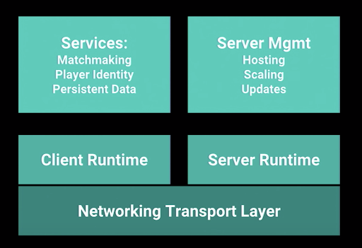

### 

Networking Transport Layer

It’s what’s closer to the hardware, sending the bits back and forward over the internet connection.

### Netcode

Is a blanket term for anything that somehow relates to networking in online games; netcode is a term most commonly used by gamers when discussing synchronization issues between clients and servers.

### QoS

Quality of service is the description or measurement of the overall performance of a service, such as a telephony or computer network or a cloud computing service, particularly the performance seen by the users of the network. Refers to any technology that manages data traffic to reduce packet loss, latency and jitter on the network. QoS controls and manages network resources by setting priorities for specific types of data on the network.

###  Client 
Is a network client that connects an individual user to the server, used mainly in multiplayer video games. It collects data such as score, player status, position and movement from a single player and sends it to the  server, which allows the server to collect each individual's data and show every player in game.

###  Server 

Is a server which is the authoritative source of events in a multiplayer video game. The server transmits enough data about its internal state to allow its connected clients to maintain their own accurate version of the game world for display to players. They also receive and process each player's input

### Hit Registration

This is how a shooter determines if your shot hit something. 

There are two forms of hit registration.

1. Games where bullet travel time is not a factor in close quarters combat can use a simple and fast formwhere bullets have no travel time. 

2. Games where you need more complex and demanding bullet physics simulations for hit registration. Every projectile has a travel speed and trajectory, affected by various factors.

Hit registration can be done by your game client (client side), which then tells the server (or in p2p, the other clients) that you hit something. 

:::tip
If a game does client side hit registration then it’s important that the server checks for every reported hit (client side, server authoritative).
::: 

The most usual 'hit registration' method is to have the server do it. The client basically tells the server in which direction you fired a shot, and the server then figures out if that shot hit something. 

## Asymmetrical multiplayer

A type of gameplay in which players can have significantly different roles or abilities from each other; enough to provide a significantly different experience of the game. 

- **Soft Asymmetry:**  
Players have the same basic mechanics (such as movement and death), yet have different roles in the game.

- **Strong Asymmetry:** 
One player/team may have one gameplay experience (or be in softly asymmetric roles) while the other player/team play in a drastically different way, with different mechanics and/or a different type of objective.
