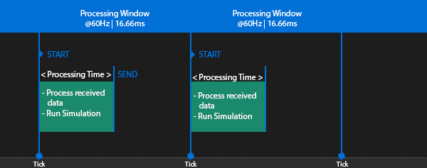

Every player is affected by a certain amount of latency, which is the result of the distance to the server/host, the number of hops a packet has to make, and the server's tick rate and update rate.

This is where Network Latency Management comes in. Due to these delays, you would see where a player was a few milliseconds ago, not where they are right now. If the game didn't compensate for at least a portion of this delay, then you would be unable to hit other players.

## Server rewind

The server uses the latency of the player (including any inherent delay due to interpolation) to rewind time by an appropriate amount in order to determine what the shooting client saw at the time the shot was fired.
 

## Snapshot Interpolation

A ------> B

When a snapshot from the server arrives, instead of immediately updating the position of an object, the client buffers the state. Snapshot Interpolation is the process of interpolating between the last two received game states to provide a visually smooth representation. 

Over an interpolation interval, the object will be rendered  smoothly  moving between the two positions. 

## Extrapolation

A ---- B -----> 

Extrapolation is an attempt to estimate a future game state. On receipt of a packet from the server, the position of an object is updated to the new position. Awaiting the next update, the next position is extrapolated based on the current position and the movement at the time of the update. 

The client will normally assume that a moving object will continue in the same direction. When a new packet is received, the position may be updated.

## Action casting

Server driven action, but with client-side “casting” animations and sounds that respond to client inputs. This is to get responsiveness while still keeping the action server driven.

## Client prediction:

- **Deterministic lockstep:**
  A method of networking a system from one computer to another by sending only the inputs that control that system, rather than the state of that system

- **Deterministic rollback:**
  An enhancement of deterministic lockstep where clients forward-predict inputs while waiting for updates. This setup is more complex but enables a more responsive game than lockstep. It’s relatively inexpensive and secure, but with very complex determinism and simulation.

- **Input prediction:**
  (and reconciliation to correct differences between client and server) TODO

- **Ghost prediction**
  Client side prediction where input isn’t involved. For example, knowing an AI’s state at frame i, we can predict its state at time i+1 assuming it’s deterministic enough to run the same both client side and server side.
     

## Latency

Is the time delay between the cause and the effect of some physical change in the system being observed. 

Network time between sending a packet and receiving that packet.

## Lag

Perception felt by an end user that there are delays to their inputs, often caused by network latency. 

## Jitter

The rate at which ping changes over a period of time (otherwise known as 'ping spikes' or 'stuttering'). 'Jittering' is essentially the fluctuation or variation of latency over time

## RTT

Latency A → B + frame calculation time + B → A

Is the amount of time it takes for a signal to be sent plus the amount of time it takes for an acknowledgement of that signal to be received. 

## Ping

A → B + B → A

Round Trip Time without frame calculation. 

When a PC or console "pings" the server, it sends an ICMP (Internet Control Message Protocol) echo request to the game server, which then answers this request by returning an ICMP echo reply.

The time between sending the request and receiving the answer is your ping to the game server. This means that with a ping of 20ms, it takes data 10ms to travel from the client to the server, as the ping is the round-trip time of your data.

Higher ping values mean that there is more delay or lag, which is why you want to play on servers with very low pings, as that is the basic prerequisite for games to feel snappy and responsive.

## Update Rate

What adds an extra delay on top of the travel time of our data (ping), is how frequently a game sends and receives that data.When a game sends and receives updates at 30Hz (30 updates per second), then there is more time between updates than when it sends and receives updates at 60Hz.

Low update rates do not only affect the network delay; they also cause issues like "super bullets," where a single hit from a gun deals more damage than it should be able to deal. 

Let’s say that the game server sends 10 updates per second. At this update rate we have 100ms between the updates, which is the same time that we have between two bullets when a gun fires 600 rounds per minute.

But many shooters have guns which fire 750 rounds per minute or more. As a result, we then run out of updates and so the game has to send multiple bullets with one update. If two bullets hit a player, then the damage of thesetwo hits will be sent in a single update, and so the receiving player will get the experience that he got hit by a "super bullet" that dealt more damage than a single hit should be able to deal.

## Tick or Simulation Rate

The tick rate, or simulation rate, tells us how many times per second the game produces and processes data.

At the beginning of a tick, the server starts to process the data it received and runs its simulations. Then it sends the result to the clients and sleeps until the next tick happens. The faster the server finishes a tick the earlier the clients will receive new data from the server, which reduces the delay between player and server. That leads to a more responsive hit registration. 

A tick or simulation rate of 60Hz will cause less delay than a tick rate of 30Hz, as it decreases the time between the simulation steps. A tick rate of 60Hz will also allow the server to send 60 updates per second, which compared to 30Hz reduces the round trip delay between the client and the server by about 33ms (-16ms from the client to the server, and another -16ms from the server to the client).

When a server gets close to the limit, or even fails to process a tick inside that timeframe, then you will instantly notice the results: all sorts of strange gameplay issues like rubber banding, players teleporting, hits getting rejected, and physics failing.
