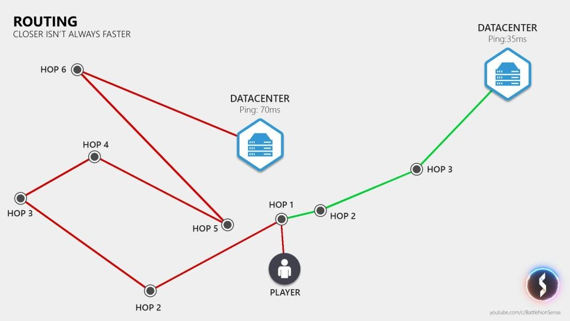

### IP address 

An Internet Protocol address is a numerical label assigned to each device connected to a computer network that uses the Internet Protocol for communication. An IP address serves two main functions: host or network interface identification and location addressing.

### Port 

A network port is a process-specific or an application-specific software construct serving as a communication endpoint, which is used by the Transport Layer protocols of Internet Protocol suite, such as User Diagram Protocol (UDP) and Transmission Control Protocol (TCP)

### Socket

A socket is one endpoint of a two-way communication link between two programs running on the network. A socket is bound to a port number so that the TCP layer can identify the application that data is destined to be sent to. An endpoint is a combination of an IP address and a port number.

### Packet

Packets are composed of a header and payload. 

- The **header** consists of fixed and optional fields. 
- The **payload** is the data that is carried on behalf of an application
The payload appears immediately after the header

### Protocols

**Transmission Control Protocol (TCP)** 

Transmission Control Protocol (TCP) is a connection-oriented communications protocol that facilitates the exchange of messages between computing devices in a network. It is the most common protocol in networks that use the Internet Protocol (IP); together they are sometimes referred to as TCP/IP.

TCP takes messages from an application/server and divides them into packets, which can then be forwarded by the devices in the network – switches, routers, security gateways – to the destination. TCP numbers each packet and reassembles them prior to handing them off to the application/server recipient. Because it is connection-oriented, it ensures a connection is established and maintained until the exchange between the application/servers sending and receiving the message is complete.

**User Datagram Protocol (UDP)** 

User Datagram Protocol (UDP) uses a simple connectionless communication model with a minimum of protocol mechanisms. UDP provides checksums for data integrity, and port numbers for addressing different functions at the source and destination of the datagram. It has no handshaking dialogues, and thus exposes the user's program to any unreliability of the underlying network; there is no guarantee of delivery, ordering, or duplicate protection. 

UDP is suitable for purposes where error checking and correction are either not necessary or are performed in the application; UDP avoids the overhead of such processing in the protocol stack. Time-sensitive applications often use UDP because dropping packets is preferable to waiting for packets delayed due to retransmission, which may not be an option in a real-time system.

### Routing

A data packet travels at a more or less fixed speed, so a player's ping is directly affected by the distance between the player and the server. However, the copper and fiber optic cables do not take a direct path to the data center, so the path, or route, to a data center that's physically farther away could actually end up being shorter than a route a data center that's physically closer to you.

Another factor that affects the data travel time is the number of stops (or hops) that your data packet must make on its way. Every additional hop also increases the risk that you lose a data packet.

**Packet loss** — where did my data go?

There's no guarantee that your packet will actually reach its destination. When a packet disappears, this is called packet loss, which is a big problem for real-time applications such as online games, as re-sending that data increases the delay.

