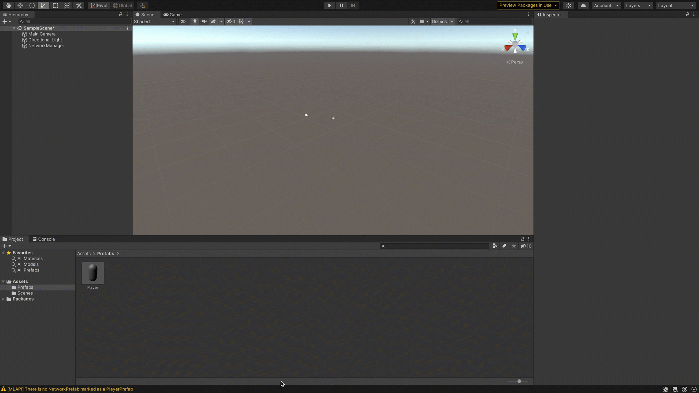

## Create a new project in Unity

1. Open the Unity Hub.
1. Click New. 
1. Select type ‘3D’
1. Rename the project "Hello World".
1. Select the location to save the project.

:::important
This tutorial requires an MLAPI-supported version of Unity (2019.4+).
:::

 

## Import MLAPI Package via URL

1. Open the package manager by navigating to Window > Package Manager on Unity’s main menu.
1. Click  in the status bar.

  The following options are displayed:

   - Add package from disk...
   - Add package from tarball...
   - Add package from git URL...

1. Select **Add** package from git URL...
1. Enter the Git URL https://github.com/Unity-Technologies/com.unity.multiplayer.mlapi.git?path=/com.unity.multiplayer.mlapi#develop.
1. Click **Add**.
   
    

You have now installed MLAPI.

## Create the Basic Components

1. Right click in the Hierarchy tab of the Main Unity Window.
1. Select **Create Empty**.
1. Rename the GameObject **NetworkManager**.
   
     
  :::tip
  We renamed the GameObject because:
    * It makes it  easier to refer to later.
    * There is one and only one **NetworkManager**, this is the object that contains the  `NetworkManager` component.
  :::

  You have now created a new GameObject called **NetworkManager**.

1. Select **NetworkManager**.
1. Click **Add Component** in the Inspector Tab.
1. Select **MLAPI** from the list shown.
1. Select `NetworkManager` Component from the list displayed.
1. Inside the `NetworkManager` component tab, locate the  `NetworkTransport` field. 
1. Click "Select Transport".
1. Select `UnetTransport`.

  

1. Create 3D Object->Capsule (name it **Player**). 
1. Add a `NetworkObject` component.
1. Click the Assets folder.
1. Create a new Folder and call it **Prefabs**.
1. Make **Player** a prefab by dragging it to **Prefabs** folder you just created.

  

1. Delete **Player** from scene.

  :::tip
  We must remove the **Player** object from the scene after we create the prefab.  As we will see shortly, we will configure the library to automatically spawn this prefab for each player that connects.  If we left **Player** in the scene, then when running the game the library would (as desired) spawn a **Player** for each connected player but also Unity - as it does for all scene objects - would place an extra, unwanted **Player** in the scene.  Note, MLAPI can and will track scene objects defined in this way (say for server-controlled elements).
  :::

1. Add Player prefab to `NetworkPrefabs` list inside of `NetworkManager`.  You will first need to click the `+` to create a slot, then drag in your prefab.
1. Select **Default Player Prefab.**

  

  :::tip
  When you select the **Default Player Prefab** , you are telling the library that when a client connect to the game, automatically spawn this prefab as the character for the connecting client. If you do not have the default selected for any prefab the game will crash on client connect
  :::
  :::note
   You may see the following error reported `There is no NetworkPrefab Marked as a PlayerPrefab` Once you have completed the above steps you can clear the error by doing the following:
   1. Select the Console tab.
   1. Select Clear.
   
    
  :::

1. Create a GameObject->Plane, centered at (0,0,0).
1. Click **Play**.
1. Click **Start Host** under **NetworkManager**. 

  

:::note Congrats!!!!
Congratulations you have created a networked game. It is not a very flashy game but it is a networked game nonetheless. For the next steps in your journey see [Building on "Hello World"](helloworldparttwo.md)
:::
