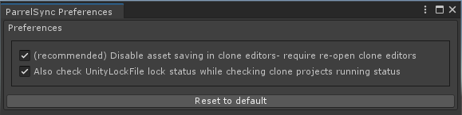

- [Player Builds](#player-builds)
	- [Local iteration using Player Builds](#local-iteration-using-player-builds)
- [ParrelSync](#parrelsync)
	- [Installation](#installation)
	- [Usage](#usage)
	- [Known issues and workarounds](#known-issues-and-workarounds)
- [General tips](#general-tips)

Testing a multiplayer game presents unique challenges to developers:
 - We need to run multiple instances of the game in order to test multiplayer scenarios. 
 - We also need to iterate quickly on our custom code and asset changes and validate our work in a multiplayer scenario.
 - We need to be able to debug our work in a multiplayer scenario using editor tools.

Currently, Unity does not provide any workflow that covers all of these requirements. (See our [roadmap here](https://unity.com/roadmap/unity-platform/multiplayer-networking))

There will always be a need to validate our work in the target distribution format (ie. on platform) and the way to do it is by creating [Player Builds](#player-builds). 

However, player builds do not meet the requirement of quick iteration and easy debuggability using editor tools. As such our current recommended workflow for local iteration [ParrelSync](#parrelsync).

## Player Builds

:::hint

This approach is great when we need to verify our work on the target platform or with a wider group of testers.

:::

First we need to build an executable. The default way of doing that is via  `File->Build Settings` in the menu bar, and then pressing `Build` button.

Then the build can be shared among the testers.

### Local iteration using Player Builds

Once the build has completed you can launch several instances of the built executable in order to both host and join a game.

It is also possible to run the builds along with an editor that produced said build, which could be useful during iterations.

> Mac users: to run multiple instances of the same app, you need to use the command line.
> Run `open -n YourAppName.app`

:::hint

Though functional, we find this approach to be somewhat slow for the purposes of local iteration. Head on to the [ParrelSync](#parrelsync) section for our suggested workflow for local iteration.

:::

## ParrelSync

[**ParrelSync**](https://github.com/VeriorPies/ParrelSync) is an open-source Unity editor extension that allows users to **test multiplayer gameplay without building the project** by having another Unity editor window opened and mirror the changes from the original project. 

**ParrelSync** works by making a copy of the original project folder and creating symbolic links to the `Asset` and `Project Settings` folders back from the original project.

We use **ParrelSync** for local iteration in [BossRoom sample](https://github.com/Unity-Technologies/com.unity.multiplayer.samples.coop/).

:::important

**ParrelSync** relies on symbolic links and partial copies of the original project folder structure - generally it is completely safe. 

Yet, just to be sure that no bug in any of the software you use can destroy your work - it's a good idea to consistently backup your project or use a version control system such as [Git](https://git-scm.com/), [SVN](https://subversion.apache.org/), [Plastic](https://www.plasticscm.com/) or any other.

:::

### Installation

Follow the installation instructions on **ParrelSync** repo [page](https://github.com/VeriorPies/ParrelSync#installation)

### Usage
 - Open the `ParrelSync->Preferences` menu in the menu bar to open the preferences window
 - Verify that your settings are set to the following: 

:::important

By default **ParrelSync** prevents asset serialization in all clone instances and changes can only be made from the original project editor. This is a **very important setting** that prevents issues with multiple editors accessing the same `Library` folder (which is not supported and breaks basic assumptions in Unity design).

:::

 - Open the `ParrelSync->Clones Manager` from which you can launch, create and remove clone editors.
	 - Advanced usage is to utilize **ParrelSync's** capability of passing [Arguments](https://github.com/VeriorPies/ParrelSync/wiki/Argument) to clones, thus allowing to run custom logic on a per-clone basis.

### Known issues and workarounds
 - An important nuance is that **ParrelSync** does not sync changes made to packages. `Packages` folder is synced on clone opening, so if you made package changes - you should close and re-open your clones.
   - [Relevant GitHub issue](https://github.com/VeriorPies/ParrelSync/issues/48)
 - If you encounter a Netcode error that mentions `soft sync` - that generally means that prefabs or scenes are not in sync between editors. You should save the project in the main editor via `File->Save Project` and refresh the projects in the clone editors by pressing `Ctrl + R` (which is by default done automatically) or reimport networked prefabs in the main editor.
 - More information and general **ParrelSync** FAQ: https://github.com/VeriorPies/ParrelSync/wiki/Troubleshooting-&-FAQs
 - The ultimate workaround in case nothing helps - deleting and re-creating the clone instance via `ParrelSync->Clones Manager` window.

## General tips
 - Bigger screens or multi-screen setups allow for more screen real estate, which is handy when one has to have multiple instances of an app opened at the same time.
 - **ParrelSync** has to copy and update separate `Packages` and `Library` folders for every clone, and in certain cases a fix for misbehaving clone is re-creation - a good SSD makes this process quite a bit faster.
 - Creating a fork of any git repository that your project relies upon in production could help avoid bad surprises if the repo gets taken down or introduces an undesirable change. You should fork **ParrelSync** before using it in your live project.
 - 
:::contribution Special Thanks
This guide would not have been possible without the hard work and support of Philipp Deschain, Unity. 
:::