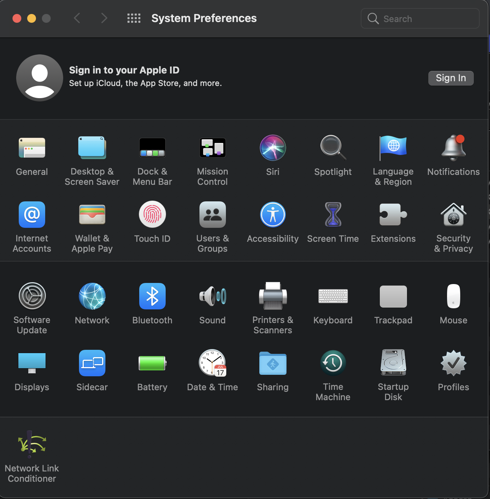

When developing a multiplayer game that is intended to operate over the internet you  have to deal with the reality of poor network conditions.

Adverse network factors, such as [latency, jitter and packet loss](lagandpacketloss.md) all have to be taken into account during development and the tolerance thresholds for these should not be an afterthought or something relegated to an "optimization pass". 

:::warning
Not testing with artificial network conditions makes it significantly more likely to have unexpected behaviors when the game is running over the internet.
:::

This is challenging when you are [iterating on our game locally](testing_locally.md) - becasue all of the game instances are still running on the same network interface. It's reasonable to expect that there will be little to no latency between the clients, which is no good for testing in this case you want the network to **misbehave**. 

Thankfully there are a number of tools that can simulate adverse network conditions.

**Testing Locally**  

For testing locally within the editor we suggest using [Unity Transport - Simulator Tools](#unity-transport---simulator-tools) along with [clone-based workflow via ParrelSync](testing_locally.md#parrelsync).

**Testing Development Builds**

For testing development builds with built-in artificial latency we suggest using [Unity Transport Simulator Tools with some custom code to inject artifical conditions into the build](#debug-builds).


**Testing Release Builds**

For testing release builds we suggest using either [Clumsy](#clumsy-on-windows) if you're on Windows, and [Network Link Conditioner](#network-link-conditioner-on-osx) if you're on Mac OS.

## General advice

It's not immediately obvious what the values and options you should enable in network conditioning tools. All of them allow you to alter various aspects of network conditions such as [latency, jitter and packet loss](lagandpacketloss.md), though the names for concepts and the specific functionality varies between tools.

The values you use will be different depending on the exact debugging goal, but generally you want the artificial conditions to  match up to what your users will deal with in reality.

### So how do you reason about what our lag threshold is? 

In order to answer this question you need to look for information regarding typical and acceptable delays for our game genre.

:::info
Fighting games, First Person Shooters etc are on one side of the spectrum - they require fast reaction times and as such have less of an acceptable threshold for lag, whereas the Realtime Strategy games are on the other side of the spectrum, they are in general tolerant of much higher delays.
:::

Then, to determine how much chaos you want to introduce you need to imagine the situations in which people will be playing the game:
 - Are they playing from their homes (with good internet connections, but a possibility of a WiFi network)?
 - Are they playing from their phones, using mobile networks of varying quality?

This question tells us if our users are likely to experience more jitter and packet loss - mobile networks are notorious for having widely varying quality of connection.

What's important here is that testing purely with added delay and no packet loss and jitter is extremely unrealistic. These values shouldn't be high - the baseline scenario is not what we would call stress-testing, but they should be non-zero.

Adding jitter to the base delay value adds a layer of chaotic unreliability that would make our peers behave in a more natural way, allowing us to tweak our interpolation, buffering and other techniques to compensate for these instabilities.

Adding packet loss, apart from introducing even more effective delay to our system could also wreak havoc on our unreliable messages, thus allowing us to explore if we need more defensive logic surrounding our unreliable messages or if we should opt for a reliable message instead.

:::unity Boss Room Example

Testing Boss Room on desktop, we've used artificial lag between 80ms and 120ms with 5%-10% packet loss.
:::

### Different network conditions for different peers

:::important

[Clumsy](#clumsy-on-windows) and [Network Link Conditioner](#network-link-conditioner-on-osx) are introducing changes on OS level, thus all the instances of the game that we open on our local machine would run under the same network conditions. 
 
QA teams run playtests with multiple people, each with their own system-wide conditioning settings settings. We can imitate this workflow locally by setting different per-peer network conditions. This approach is not as reflective of reality as good QA tests on different machines, but it allows us to test these more peculiar scenarios locally. 

:::

There is a group of scenarios where we would want to test how the game behaves when a player with a different baseline connection quality from most of our other peers joins the game - an example of such case could be someone playing from a significantly remote location or connecting from a device that's on a mobile network.

In this case we would want to have an ability to set artifical conditions on a per-peer basis, which is possible with [Unity Transport Simulator Tools](#unity-transport---simulator-tools). 

## Unity Transport - Simulator Tools

[Unity Transport for Necode for GameObjects](https://github.com/Unity-Technologies/com.unity.netcode.gameobjects/tree/develop/com.unity.netcode.adapter.utp)comes with it's own tool for simulating artificial adverse network conditions - the Simulator Tools window.

It allows the developer to set latency, jitter and packet loss percentage:
![[simulator-tools.png]]

To use the Simulator Tools:
 - install the [Unity Transport for Necode for GameObjects](https://github.com/Unity-Technologies/com.unity.netcode.gameobjects/tree/develop/com.unity.netcode.adapter.utp) package via Package Manager
 - Click the `Netcode->Simulator Tools` menu item in the menu bar
	 - The window allows you to set the values on a per-client basis
	 - When using ParrelSync workflow for local iteration - we'd have to set these values in each separate clone editor

### Clone-based workflow (ParrelSync)

Simulator Tools effects only apply to editor instances and to [debug builds](#debug-builds), as such it matches really well with [clone-based workflow via ParrelSync](local-Iteration-testing-multiplayer-games-locally.md#). 

Other tools should be used when testing release builds locally.

To combine the benefits of Simulator Tools Window with ParrelSync - create or open a clone of your project, open up the simulator tools window in both the main project and the clone and play with the settings to alter how network behaves for each individual peer. Remember to re-launch your game if you change the values in the tools window - the effects only take place when the UTP driver is being created.

:::important

With Simulator Tools we can't specify if inbound packets and outbound packets would experience different conditions - artificial latecny, jitter and packet loss are bi-directional.

:::

:::important

Simulator Tools window settings will not be committed to version control and need to be set up manually on different editor instnaces.

:::

### Debug Builds

Debug builds do allow for the possibility of applying artificial network conditions to the UTP driver, but the Simulator Tools window itself only sets these values in the Editor.

To set the latency, jitter and packet-loss percentage values for develop builds we need the following code to execute before `NetworkManager` attempts to connect (changing the values of the paramters as desired):

```
#if DEVELOPMENT_BUILD && !UNITY_EDITOR
        UnityTransport.ClientPacketDelayMs = 120;
        UnityTransport.ClientPacketJitterMs = 5;
        UnityTransport.ClientPacketDropRate = 3;
#endif
```

## System-wide network conditioners

These tools are useful when we want to test builds as opposed to running multiple editor instances. It is also an option that works for **release** builds. 

:::important

The solutions described below share some common features:
 - They do not support latency variability over time, so in effect we can't imitate artificial jitter with them.
 - They are system-wide, thus all the lcoal instances of our game would run under the same network conditions.
 - Both allow to control the settings for sending and receiving separately.

:::

There are some inherent limitations that come with the system-wide level of application of these tools - they are not ideal for local testing of more than two peers because we can't have peers with different network conditions between them (if that is important for the test ofcourse).

### Clumsy on Windows

Follow the installation instructions on the official [Clumsy Webpage](https://jagt.github.io/clumsy/).

To test the builds with Clumsy:
 - Run Clumsy
 - Run instance 1
 - Run instance 2
 - At any point you can adjust Clumsy settings and observe the changes in gameplay fidelity

#### Settings quickstart
 - Lag - that's our primary lever to control artifical latency
 - Drop - that's our packet loss
 - Throttle, Out of Order, Duplicate, Tamper - these will manifest as additional latency but should be automatically handled for us by Netcode. 
   - Since Clumsy doesn't have Jitter functionality - we can emulate jitter (inconsistnent latency over time) by playing with these parameters. Their cumulative effect would produce artifical latency fluctuations.

For further reading please refer to the Details section of the [Clumsy Webpage](https://jagt.github.io/clumsy/) - the settings explanation there goes more into the actual mechanics of each individual setting.


### Network Link Conditioner on OSX

Apple's Network Link Conditioner can be downloaded from the [Additional Tools for XCode page](https://developer.apple.com/download/all/?q=Additional%20Tools). This page requires logging in with Apple developer account.
Download the version that's appropriate for your XCode version and then run the .dmg file. Navigate to the `Hardware` folder and install the Network Link Conditioner panel. 

After that you will be able to find Network Link Conditioner in the System Preferences panel of your Mac:


To test the builds with Network Link Conditioner:
 - Run Network Link Conditioner
 - Run instance 1
 - Run instance 2
 - At any point you can adjust Network Link Conditioner settings and observe the changes in gameplay fidelity

#### Settings quickstart

In order to get to the settings we need to go into the `Manage Profiles` menu and either pick one or create our own.

 - Downlink and Uplink Bandwidth are useful for testing how our game would behave if it's starved for bandwidth, but generally tightening it too much would gradually degrade any networked game.
 - Downlink and Uplink Packets Dropped % is exactly what it seems - packet loss percentage. 
 - Downlink and Uplink Delay are our levers for controling artificial latency
