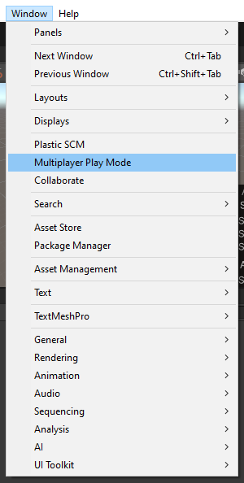
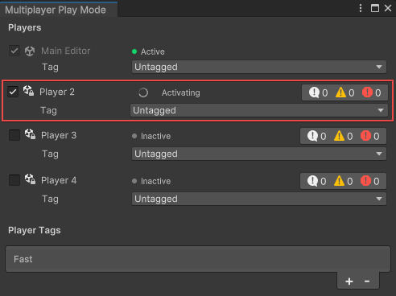
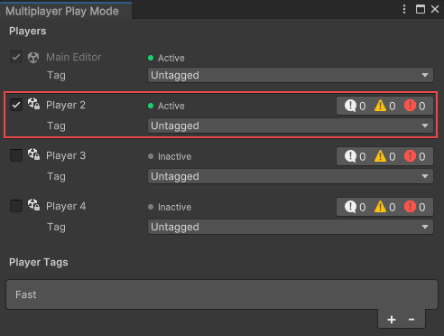
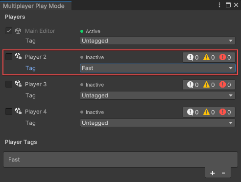
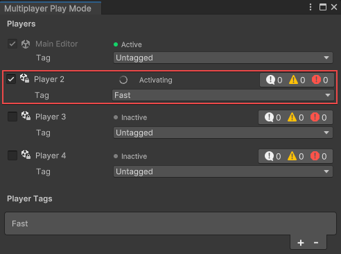
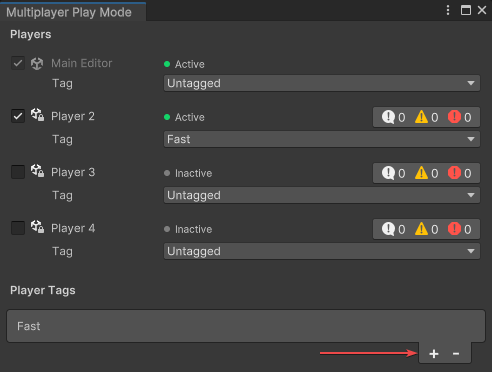
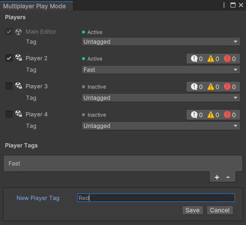
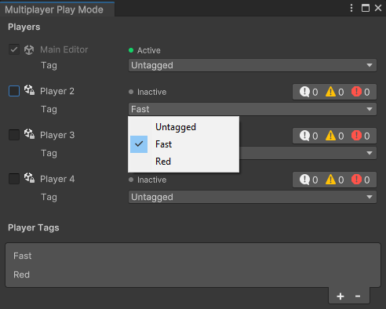
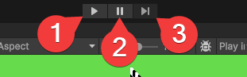

Multiplayer Play Mode (MPPM) enables you to test multiplayer functionality without leaving the Unity Editor. You can simulate up to four Players (the Main Editor Player plus three Virtual Players) simultaneously on the same development device while using the same source assets on disk. You can leverage MPPM to create multiplayer development workflows that reduce the time it takes to build a project, run it locally, and test the server-client relationship.

:::important
Multiplayer Play Mode isn't part of the Multiplayer Tools package. MPPM is a separate package that is netcode agnostic. This feature can be used with any netcode solution, including custom and Netcode for GameObjects.
Check the [Requirements](#requirements) section below for further information
:::

This document uses the following terminology to distinguish between the primary Unity Editor project and the Virtual Player instances:

- The **Main Editor** refers to the primary (or original) instance of the project in the Unity Editor, and this is the only instance with full authoring capabilities.
- **Virtual Players** refers to simulated Players created with Multiplayer Play Mode that open in a separate window with limited authoring capabilities when you enter **[Play mode](https://docs.unity3d.com/Manual/GameView.html)**.
- **Players** refers to all Player instances, including the Main Editor Player and all Virtual Players.

## Releases

| Version  | Release date | Notes                                               |
|----------|:------------:|----------------------------------------------------|
| 0.1.1    | 2023-01-26   | See [MPPM release notes](../releases/tools/mppm-release-notes.md) |
| 0.1.0    | 2022-11-15   | See [MPPM release notes](../releases/tools/mppm-release-notes.md) |


## Requirements

You must meet the following requirements to use Multiplayer Play Mode:

- Install Unity Editor version 2023.1 or later
- Install the `com.unity.multiplayer.playmode` package (version 0.1.0 or later)

### Limitations

MPPM has some inherent technical limitations, specifically around [scale](#scale) and [authoring](#authoring).

#### Scale

The Unity Editor (and Virtual Player instances) require a lot of system resources; as a result, you shouldn’t use MPPM at scale. It’s designed for use in small-scale, local testing environments. By default, MPPM supports up to four Players (the Main Editor plus three Virtual Players).

#### Authoring

Virtual Player instances open in a Unity Editor window when you enter Play mode. These instances have restricted authoring capabilities because they’re intended as a vehicle to open multiple project runtimes, not to offer multi-editor authoring workflows.

You should use the Main Editor to make changes and the Virtual Players to test multiplayer functionality. This way, you can continue to use existing Editor workflows without learning how to use the Unity Editor in new ways.

You can't access any functionality of the Main Editor from Virtual Players.

### Performance impact

Each Virtual Player increases the demand for system resources. MPPM limits the performance impact of Virtual Players by sharing specific resources, such as the artifact database and imports, between the Main Editor and each Virtual Player.

## Getting started

You can access MPPM by opening the Multiplayer Play Mode window: Select **Window** > **Multiplayer Play Mode**.



The Multiplayer Play Mode window allows you to access Virtual Players and Player Tags.

## Players

Players represent either the Main Editor Player or the Virtual Players that you can enable and disable with the checkbox next to the Virtual Player name (from the Multiplayer Play Mode window). There are four available Player slots:

- Player 1 (The Main Editor)
- Player 2 (Virtual Player)
- Player 3 (Virtual Player)
- Player 4 (Virtual Player)

### Enable a Virtual Player

You can enable up to four Players simultaneously (the Main Editor Player plus three Virtual Players). Note that you must activate Virtual Players before entering **Play mode**.

To enable a Virtual Player:

1. Select the checkbox next to the Virtual Player name (for example, Player 2).



2. Wait for Unity to activate the Virtual Player.
3. After the Player is activated, the status changes from **Activating** to **Active**, and you can use the Virtual Player in testing.



4. Select the **Play** button in the Main Editor.

A Unity Editor Play Mode window should open for each enabled Player (with the window titled after the Player name).

## Player Tags

You can think of Player Tags like launch arguments for Players (the Main Editor Player and Virtual Players). You can configure Player Tags to do things such as:

- Configure a Player to run as a client, server, or host automatically.
- Configure a Player to automatically run as a member of a specific team (for example, “Red Team” or “Blue Team”).
- Configure a Player to move faster or slower.

### Attach a Player Tag to a Player

You can attach a Player Tag to a Player by selecting the Player Tag from the Tag drop-down list. In the following example, a single Player Tag (named "Fast") configures a Virtual Player to allow the Player to move faster than the other Players.

:::warning
You can't attach a Player Tag to an active Player. You must first disable the Player, then attach the Player Tag.
:::

1. Select the Player Tag from the **Tag** drop-down for the Player.



2. Enable the Player by selecting the checkbox to its left.



### Add a Player Tag

You can add a Player Tag through the Multiplayer Play Mode window. When you add a Player Tag, it’s automatically added to the `VirtualProjectsConfig.json` file in the `ProjectsSettings` folder.

1. Select the **+** symbol under Player Tags.



2. Name the Player Tag.



3. Select **Save**.

You should now see the new Player Tag listed under Player Tags and in the drop-down menu for the Tag option of each Player.



### Configuring Player Tags

Alone, Player Tags don’t do much at all. You have to target the Player Tag in your game scripts with `CurrentPlayer.Tag`. See the following Player Tag examples:

- [Run as a server, client, or host](#run-as-a-server-client-or-host)
- [Automatically assign to team](#automatically-assign-to-team)
- [Simulate network conditions](#simulate-network-conditions)

There’s no restriction on where you can keep these scripts that work with Player Tags, but you must attach the scripts to a [NetworkObject](../docs/basics/networkobject.md) (such as the Player).

The logic in some of the following examples checks if the Player Tag has a string rather than if it’s equal to a string to allow for more flexibility with the name of the Player Tag. You can also change this logic so that it checks for an exact match.

:::note
Some of the following examples use the `Contains` method, which is case-sensitive by default, but you can make it case-insensitive by passing the `System.StringComparison.CurrentCultureIgnoreCase` method.
:::

#### Run as a server, client, or host

The following script uses the Netcode for GameObjects [NetworkManager](../docs/components/networkmanager.md) to automatically connect the Virtual Player as a server, client, or host based on the attached Player Tag. For example, a Player with the “Server” Player Tag automatically runs as a server, and a Player with the “Client” Player Tag automatically runs as a client.

:::note
This example uses [Netcode for GameObjects (NGO)](../docs/about.md).
:::

```csharp
using Unity.Netcode;
using UnityEngine;
using Unity.Multiplayer.Playmode;

/// A MonoBehaviour to automatically start Netcode for GameObjects
/// clients, hosts, and servers
public class MppmConnect : MonoBehaviour
{
    void Start()
    {
        var mppmTag = CurrentPlayer.Tag;
        var networkManager = NetworkManager.Singleton;
        if (mppmTag.Contains("Server"))
        {
            networkManager.StartServer();
        }
        else if (mppmTag.Contains("Host"))
        {
            networkManager.StartHost();
        }
        else if (mppmTag.Contains("Client"))
        {
            networkManager.StartClient();
        }
    }
}
```

#### Automatically assign to team

The following script automatically sets a [NetworkVariable](https://docs-multiplayer.unity3d.com/netcode/current/basics/networkvariable) called `Team` based on the Player Tag. For example, a Player with a Player Tag named “Red” automatically sets the `Team` NetworkVariable to Red. A Player with a Player Tag named “Blue” automatically sets the `Team` NetworkVariable to Blue.

```csharp
using Unity.Netcode;
using UnityEngine;
using Unity.Multiplayer.Playmode;

public enum Team { Blue, Red, }

/// A player with a team that is automatically assigned
/// based on the Player Tag of the client that owns them
public class Player : NetworkBehaviour
{
    public NetworkVariable<Team> team = new (writePerm: NetworkVariableWritePermission.Owner);

    void Start()
    {
        var localClientId = NetworkManager.Singleton.LocalClientId;
        if (!team.CanClientWrite(localClientId))
        {
            return;
        }
        var mppmTag = CurrentPlayer.Tag;
        if (mppmTag.Contains("Blue"))
        {
            team.Value = Team.Blue;
        }
        if (mppmTag.Contains("Red"))
        {
            team.Value = Team.Red;
        }
    }
}
```

#### Simulate network conditions

The following script uses Network Simulation Presets from the Multiplayer Tools package to automatically apply a fast or slow network based on the Player Tag. In this example, a Player with the “FastNetwork” Player Tag simulates a common [Home Broadband](https://docs-multiplayer.unity3d.com/tools/current/tools-network-simulator#home-broadband) connection, and a Player with the “SlowNetwork” Player Tag simulates a [Mobile 2.5G](https://docs-multiplayer.unity3d.com/tools/current/tools-network-simulator#mobile-25g) connection.

:::note
This example uses the [Network Simulator](https://docs-multiplayer.unity3d.com/tools/current/tools-network-simulator) tool from the `com.unity.multiplayer.tools` package.
:::

```csharp
using System.Collections;
using System.Collections.Generic;
using UnityEngine;
using Unity.Multiplayer.Playmode;
using Unity.Multiplayer.Tools.NetworkSimulator.Runtime;

public class NetworkSimulation : MonoBehaviour
{
    void Start()
    {
        var networkSimulator = GetComponent<NetworkSimulator>() ??
                               gameObject.AddComponent<NetworkSimulator>();

        var connectionPreset = NetworkSimulatorPresets.None;
        if (CurrentPlayer.Tag == "FastNetwork")
        {
            connectionPreset = NetworkSimulatorPresets.HomeBroadband;
        }
        else if (CurrentPlayer.Tag == "SlowNetwork")
        {
            connectionPreset = NetworkSimulatorPresets.Mobile2_5G;
        }

        networkSimulator.ConnectionPreset = connectionPreset;
    }
}
```

## Synchronized Play mode

When you enter [Play mode](https://docs.unity3d.com/Manual/GameView.html), Multiplayer Play Mode synchronizes the Main Editor and Virtual Players. If you select **Pause** or **Step** in the Main Editor [Toolbar](https://docs.unity3d.com/Manual/Toolbar.html), all Virtual Players follow suit. Enabling **Error Pause** in the [Console](https://docs.unity3d.com/Manual/Console.html) of any Player sets all Virtual Players to pause when you call `Debug.LogError` from a script.

### Using Pause/Step

Because MPPM synchronizes [Play mode](https://docs.unity3d.com/Manual/GameView.html) between the Main Editor and Virtual Players, you can use the Play, Pause, and Step actions the same way you do in a standard Unity Editor workflow.



1. Selecting **Play** runs all activated Players.
2. Selecting **Pause** pauses all activated Players.
3. Selecting **Step** performs a single frame step for all activated Players.
