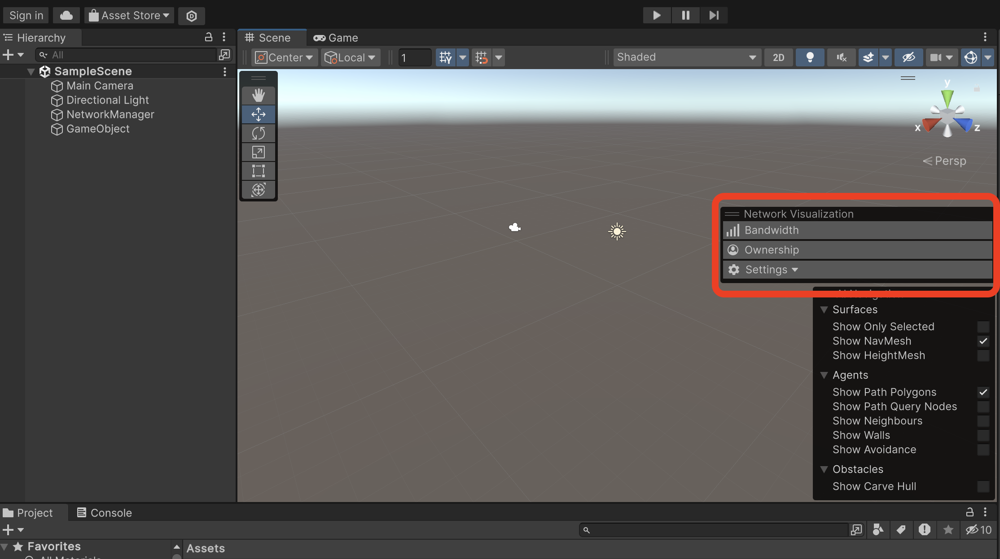

The Network Scene Visualization (NetSceneVis) is a powerful, user-friendly tool included in the Multiplayer Tools package to help you visualize and debug network communication on a per-object basis in the scene view of your project with visualizations such as mesh shading and text overlay.

When a game session is started, network messages contain information about the game state, such as the position of game objects and player actions. The NetSceneVis tool intercepts these network messages to visually display them in the Unity Editor. Each player is represented by a colored sphere, and lines show the network messages being sent between the players. The state of each GameObject in the scene, including their position, rotation, and any other relevant data is also shown.

The visualizations are updated in real-time as the network messages are sent and received, showing the game state synchronization across the network.

NetSceneVis can help diagnose issues related to network latency, packet loss, and other network-related issues that may affect the player experience in your multiplayer games. This tool can help optimize your network code to ensure that your game runs smoothly for all players.

<!-- For full release: ## Requirements
- Unity 2023.2
:::note
Unity 2023.2.0a11 is specifically required for NetSceneVis mesh shading
:::
- Up-to-date Multiplayer Tools package, see [Install the Multiplayer Tools Package](./install-tools.md). -->

<!-- Update the following Requirements section after full release for this tool. -->
## Requirements
- Unity 2023.2 (This version of the editor is in pre-release. See [Unity 2023.1 Beta Resources](https://unity.com/releases/editor/beta) for more information.)
:::note
Unity 2023.2.0a11 is specifically required for NetSceneVis mesh shading
:::
- Up-to-date Multiplayer Tools package from the `develop` branch.

### Installing Network Scene Visualization from `develop`

You can install the `develop` branch of the Multiplayer Tools package with either a git URL or as a local git clone.

### Installing from a git URL

1. Open your Unity Hub and select the Project your are presently working on.
2. In the editor's menu bar, navigate to **Window** > **Package Manager**.
3. Click the plus sign  in the Package Manager status bar and select **Add package from git URL...**.
4. Enter `https://github.com/Unity-Technologies/com.unity.multiplayer.tools` in the pop-up window and select **Add**.
5. After downloading, **Multiplayer Tools** appears under **Unity Technologies** in your **Package Manager** window.

### Installing from a local git clone
Instructions for installing a package from a local folder can be found here. A local clone of the Multiplayer Tools package can be created using the following git command:

git clone https://github.com/Unity-Technologies/com.unity.multiplayer.tools.git

1. Open your Unity Hub and select the Project your are presently working on.
2. In the editor's menu bar, navigate to **Window** > **Package Manager**.
3. Click the plus sign  in the Package Manager status bar and select **Add package from disk...**.
4. Navigate to the folder root of your local package.
5. Double-click the `package.json` file in the file browser. The file browser closes, and the package now appears in the package list with the  tag.

:::note
If you have a package installed locally that matches a version in the registry, the **Update** button still appears and the list might display the same version twice as **Currently Installed** and **Recommended**.
:::

## Using Network Scene Visualization

After [installing the Multiplayer Tools package](#requirements), the Network Visualization toolbar is available in the scene view of the Unity Editor. This toolbar includes the options to visualize networking information per-object of your game.

