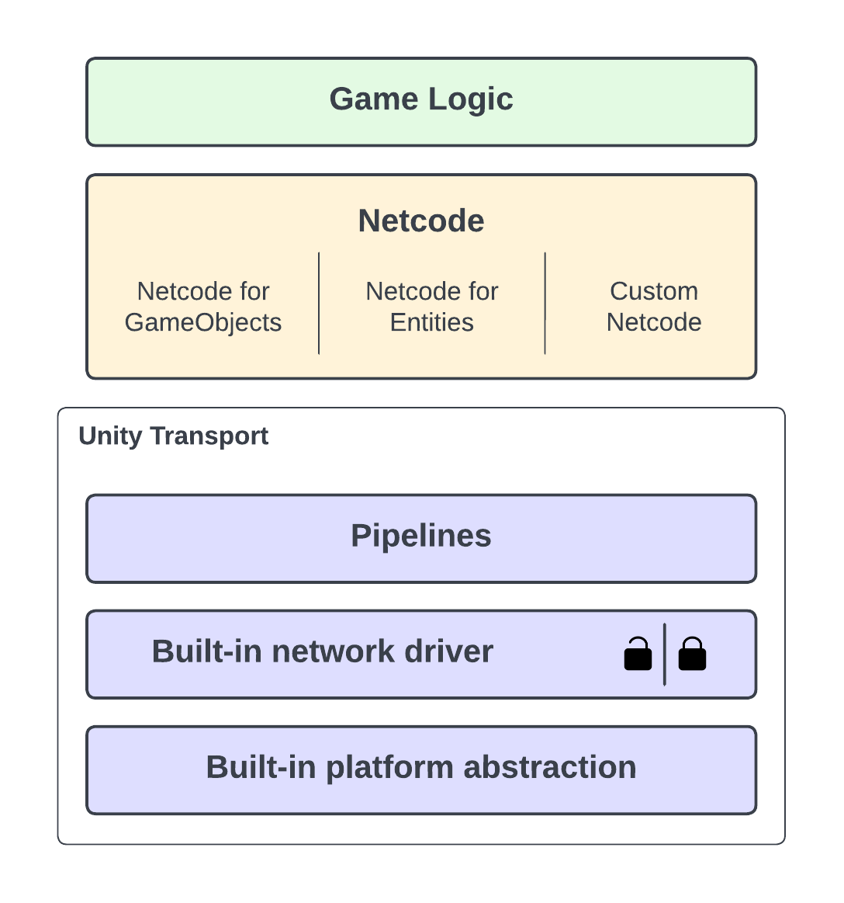

The Unity Transport package (`com.unity.transport`) is a low-level networking library for multiplayer game development.

It’s the underlying protocol of both [Netcode for GameObjects](../../docs/about.md) and [Netcode for Entities](https://docs.unity3d.com/Packages/com.unity.netcode@latest), but you can also use it with a custom solution.

Unity Transport seamlessly supports all platforms the Unity Engine supports thanks to a connection-based abstraction layer (built-in network driver) provided over UDP and WebSockets.

You can set up both UDP and WebSockets with or without encryption. The following illustration shows encrypted connections with a closed padlock and unencrypted connections with an open padlock.

You can also use [pipelines](pipelines-usage.md) to leverage additional functionality, such as reliability, packet ordering, and packet fragmentation.

## Get started with Unity Transport

See [Getting started](getting-started.md).
