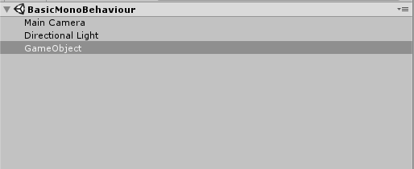
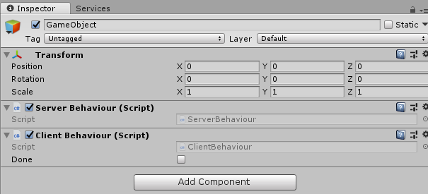
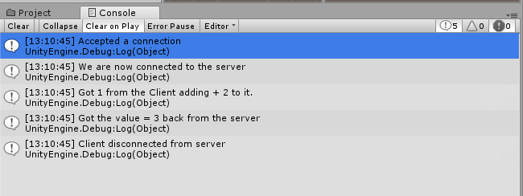

This guide walks you through using the Unity Transport package to create a simple client and server that use a remote function over a UDP connection to add two numbers with the following flow:

1. The client connects to the server.
2. The client sends a number to the server.
3. The server receives the number and adds it to another number.
4. The server sends the sum of the two numbers to the client.
5. The client receives the sum.
6. The client disconnects from the server and quits.

It shows using the Unity Transport API to:

- Configure
- Connect
- Send data
- Receive data
- Close a connection
- Disconnect
- Timeout a connection

The client-server workflow in this guide shows the subtle differences between using the `NetworkDriver` for clients and servers.

## Create a server

A server is an endpoint that listens for incoming connection requests and sends and receives messages. This section shows creating a simple server with UTP 2.0.

Start by creating a C# script in the Unity Editor. Name the script ServerBehaviour.cs.

**Filename**: [`ServerBehaviour.cs`](samples/serverbehaviour.cs.md)

```csharp
using System.Collections;
using System.Collections.Generic;
using UnityEngine;

public class ServerBehaviour : MonoBehaviour {

    // Use this for initialization
    void Start () {

    }

    // Update is called once per frame
    void Update () {

    }
}
```

The `com.unity.transport` package is a low-level API, and, as a result, there is a bit of boilerplate code you should set up. The necessity of the boilerplate code is due to an architecture design to ensure you always have full control.

:::note
As development on the com.unity.transport package evolves, Unity might create more abstractions to reduce your workload on a day-to-day basis.
:::

In the `ServerBehaviour.cs` script, clean up the dependencies and add the boilerplate code:

**Filename**: [`ServerBehaviour.cs`](samples/serverbehaviour.cs.md)

```csharp
using UnityEngine;
using UnityEngine.Assertions;

using Unity.Collections;
using Unity.Networking.Transport;

...
```

The following code shows the necessary boilerplate code and creates empty bodies for the `Start`, `OnDestroy`, and `Update` methods. It also declares a `NetworkDriver` and creates a `NativeList` to hold all connections between the client and server.

**Filename**: [`ServerBehaviour.cs`](samples/serverbehaviour.cs.md)

```csharp
using ...

public class ServerBehaviour : MonoBehaviour {

    public NetworkDriver m_Driver;
    private NativeList<NetworkConnection> m_Connections;

    void Start () {
    }

    void OnDestroy() {
    }

    void Update () {
    }

public NetworkDriver m_Driver;
private NativeList<NetworkConnection> m_Connections;
```

Next, expand the `Start`, `OnDestroy`, and `Update` methods.

### `Start` method

First, define the logic in the [`MonoBehaviour.Start` method](https://docs.unity3d.com/ScriptReference/MonoBehaviour.Start.html).

**Filename**: [`ServerBehaviour.cs`](samples/serverbehaviour.cs.md)

```csharp
void Start ()
{
    m_Driver = NetworkDriver.Create();
    var endpoint = NetworkEndPoint.AnyIpv4;
    endpoint.Port = 9000;
    if (m_Driver.Bind(endpoint) != 0)
        Debug.Log("Failed to bind to port 9000");
    else
        m_Driver.Listen();

    m_Connections = new NativeList<NetworkConnection>(16, Allocator.Persistent);
}
```

The first line of code, `m_Driver = NetworkDriver.Create()`, creates a `NetworkDriver` instance without any parameters.

Next, `m_Driver.Bind` binds the `NetworkDriver` instance to a specific network address and port, and if that doesn't fail, it calls the `Listen` method.

```csharp
   if (m_Driver.Bind(endpoint) != 0)
        Debug.Log("Failed to bind to port 9000");
    else
        m_Driver.Listen();
```

:::important
The call to the `Listen` method sets the `NetworkDriver` to the `Listen` state, which means the `NetworkDriver` actively listens for incoming connections.
:::

`m_Connections` creates a `NativeList` to hold all the connections.

```csharp
m_Connections = new NativeList<NetworkConnection>(16, Allocator.Persistent);
```

### `OnDestroy` method

You must dispose of both `NetworkDriver` and `NativeList` because they allocate unmanaged memory. To ensure proper disposal, call the `Dispose` method when you no longer need them.

Add the following code to the OnDestroy method on [`MonoBehaviour`](https://docs.unity3d.com/ScriptReference/MonoBehaviour.html):

**Filename**: [`ServerBehaviour.cs`](samples/serverbehaviour.cs.md)

```csharp
public void OnDestroy()
{
    if (m_Driver.IsCreated)
    {
        m_Driver.Dispose();
        m_Connections.Dispose();
    }
}
```

The check for `m_Driver.IsCreated` ensures you don't dispose of unallocated memory. For example, UTP doesn’t allocate memory for disabled components.

### Server `Update` loop

The `com.unity.transport` package uses the [Unity C# Job System](https://docs.unity3d.com/Manual/JobSystem.html) internally. As a result, the `m_Driver` has a `ScheduleUpdate` method call. Call the `Complete` method on the returned [JobHandle](https://docs.unity3d.com/Manual/JobSystemJobDependencies.html) inside the `Update` loop to ensure you know when to process updates.

```csharp
void Update () {

    m_Driver.ScheduleUpdate().Complete();
```

:::note
This example forces synchronization on the main thread to update and handle the data later in the `MonoBehaviour::Update` call. The workflow [Create a jobified client and server](workflow-client-server-jobs.md) shows how to use the Transport package with the C# Job System.
:::

After updating `m_Driver`, the first thing you must do is handle the connections. Start by cleaning up any stale connections from the list before processing new ones. Cleaning up stale connections ensures you don't have any old connections lying around when you iterate through the list to check for new events.

The following code iterates through the connection list and removes any stale connections.

```csharp
   // Clean up connections
    for (int i = 0; i < m_Connections.Length; i++)
    {
        if (!m_Connections[i].IsCreated)
        {
            m_Connections.RemoveAtSwapBack(i);
            --i;
        }
    }
```

The following code adds a connection while there are new connections to accept.

```csharp
   // Accept new connections
    NetworkConnection c;
    while ((c = m_Driver.Accept()) != default(NetworkConnection))
    {
        m_Connections.Add(c);
        Debug.Log("Accepted a connection");
    }
```

You now have an up-to-date connection list and can start querying the driver for events that might have happened since the last update.

```csharp
  DataStreamReader stream;
    for (int i = 0; i < m_Connections.Length; i++)
    {
        if (!m_Connections[i].IsCreated)
            continue;
```

Begin by defining a `DataStreamReader`, which you’ll use to process received Data events. Next, loop through the connections.

Call `PopEventForConnection` for each connection while unprocessed events exist.

```csharp
   NetworkEvent.Type cmd;
    while ((cmd = m_Driver.PopEventForConnection(m_Connections[i], out stream)) != NetworkEvent.Type.Empty)
    {
```

:::note
You can also use the `NetworkEvent.Type PopEvent(out NetworkConnection con, out DataStreamReader slice)` method call, which returns the first available event, the NetworkConnection that it's for, and possibly a `DataStreamReader`.
:::

Now it’s time to process events. Start with the `Data` event.

```csharp
   if (cmd == NetworkEvent.Type.Data)
    {
```

Next, try to read a `uint` from the stream and output the received data:

```csharp
   uint number = stream.ReadUInt();
    Debug.Log("Got " + number + " from the Client adding + 2 to it.");
```

After outputting the received data, add the received numbers and send the sum back to the client. To send anything with the `NetworkDriver`, you need an instance of a `DataStreamWriter`. A `DataStreamWriter` is a new type that comes with the `com.unity.transport` package. You get a `DataStreamWriter` when you start sending a message by calling `BeginSend`.

After you’ve written the sum of the two numbers to the stream, call the `EndSend` method on the driver. Off it goes!

```csharp
   number +=2;

    m_Driver.BeginSend(NetworkPipeline.Null, m_Connections[i], out var writer);
    writer.WriteUInt(number);
    m_Driver.EndSend(writer);
    }
```

:::note
This example passes `NetworkPipeline.Null` to the `BeginSend` function to tell the driver to use the unreliable pipeline to send the data. However, it’s also possible to choose not to specify a pipeline.
:::

You must handle the disconnect case. Handling the disconnect case is pretty straightforward: if you receive a disconnect message, reset that connection to a `default(NetworkConnection)`. The next time the `Update` loop runs, you should clean up the stale connections..

```csharp
               else if (cmd == NetworkEvent.Type.Disconnect)
                {
                    Debug.Log("Client disconnected from server");
                    m_Connections[i] = default(NetworkConnection);
                }
            }
        }
    }
```

You’ve now created the server, and you’re ready to create a client. Here’s a summary of the server logic:

1. Add any necessary boilerplate code.
2. Define the `Start` method logic, which includes declaring (and binding to) a `NetworkDriver` and `creating` a NativeList to hold the connections.
3. Define the `OnDestroy` method logic, which includes disposing of the `NetworkDriver` and the NativeList that holds the connections.
4. Define the `Update` loop logic, which includes listening for connections, adding connections, processing data, handling disconnections, and cleaning up stale connections.

See [`ServerBehaviour.cs`](samples/serverbehaviour.cs.md) for the full source code.

## Create a Client

This section shows creating a simple client with UTP 2.0. The client code looks pretty similar to the server code at first glance, but there are subtle differences. This part of the workflow covers the differences between them and not so much the similarities.

Start by creating a C# script in the Unity Editor. Name the script `ClientBehaviour.cs`.

Similar to the server behavior, you still need to define a `NetworkDriver`. However, the client only has one instead of a list of connections. There’s also a Done flag to indicate when the client is finished with the connection. You can also use the Done flag to exit if you have connection issues.

**Filename**: [`Assets\Scripts\ClientBehaviour.cs`](samples/clientbehaviour.cs.md)

```csharp
using ...

public class ClientBehaviour : MonoBehaviour {

    public NetworkDriver m_Driver;
    public NetworkConnection m_Connection;
    public bool Done;

    void Start () { ... }
    public void OnDestroy() { ... }
    void Update() { ... }
}
```

### Create and connect a client

Start by creating a `NetworkDriver` for the client and an address for the server.

```csharp
void Start () {
    m_Driver = NetworkDriver.Create();
    m_Connection = default(NetworkConnection);

    var endpoint = NetworkEndPoint.LoopbackIpv4;
    endpoint.Port = 9000;
    m_Connection = m_Driver.Connect(endpoint);
}
```

Then call the `Connect` method on the `NetworkDriver` you created.

Cleaning up the client is easier than cleaning up the server because you don’t need a `NativeList` to hold the connections. You only need to dispose of the `NetworkDriver`.

```csharp
public void OnDestroy()
{
    m_Driver.Dispose();
}
```

### Client `Update` loop

You start the client Update loop the same way as the server: by calling `m_Driver.ScheduleUpdate().Complete()`, then ensuring the connection succeeded.

```csharp
void Update()
{
    m_Driver.ScheduleUpdate().Complete();

    if (!m_Connection.IsCreated)
    {
        if (!Done)
            Debug.Log("Something went wrong during connect");
        return;
    }
```

The following code is similar to the server Update loop code. However, if you look closely, you can see the call to `m_Driver.PopEventForConnection` is replaced with a call to `m_Connection.PopEvent`. This is technically the same method; it just makes it clearer that you are handling a single connection.

```csharp
   DataStreamReader stream;
    NetworkEvent.Type cmd;
    while ((cmd = m_Connection.PopEvent(m_Driver, out stream)) != NetworkEvent.Type.Empty)
    {
```

Now you encounter a new event you haven't seen yet: a `NetworkEvent.Type.Connect` event. The `NetworkEvent.Type.Connect` event tells you that you received a `ConnectionAccept` message and are now connected to the remote peer.

:::note
In this case, the server listens on port 9000 on `NetworkEndPoint.LoopbackIpv4` (more commonly known as 127.0.0.1).
:::

```csharp
   if (cmd == NetworkEvent.Type.Connect)
    {
        Debug.Log("We are now connected to the server");

        uint value = 1;
        m_Driver.BeginSend(m_Connection, out var writer);
        writer.WriteUInt(value);
        m_Driver.EndSend(writer);
    }
```

Upon establishing a connection between the client and the server, the client sends a number to the server (that the server increments by two). Using the `BeginSend` / `EndSend` pattern with the `DataStreamWriter`, set value to one, write it into the stream, and send it out on the network.

When the `NetworkEvent` type is Data, read the value you received back from the server, then call the `Disconnect` method.

:::note
The recommended best practice is to set `NetworkConnection` to `default(NetworkConnection)` to avoid stale references.
:::

```csharp
   else if (cmd == NetworkEvent.Type.Data)
    {
        uint value = stream.ReadUInt();
        Debug.Log("Got the value = " + value + " back from the server");
        Done = true;
        m_Connection.Disconnect(m_Driver);
        m_Connection = default(NetworkConnection);
    }
```

You must handle potential server disconnects:

```csharp
            else if (cmd == NetworkEvent.Type.Disconnect)
            {
                Debug.Log("Client got disconnected from server");
                m_Connection = default(NetworkConnection);
            }
        }
    }
```

You’ve now created the server and client, and you’re ready to put it all together. Here’s a summary of the client logic:

1. Define the `Start` method logic, which includes declaring (and binding to) a `NetworkDriver`.
2. Define the `OnDestroy` method logic, which includes disposing of the `NetworkDriver`.
3. Define the `Update` loop logic, which includes connecting to the server, handling the Connect event, sending data, receiving data, and handling disconnections.

See [`ClientBehaviour.cs`](samples/clientbehaviour.cs.md) for the full source code.

## Test the server and client

If you’ve been following along with the tutorial and using the sample code, you now have a functional server and client. This section shows how to put it together and test it in the Unity Editor.

Add a new empty [GameObject](https://docs.unity3d.com/ScriptReference/GameObject.html) to your **Scene**.



Add both the `ServerBehaviour` and the `ClientBehaviour` scripts to the GameObject.



Select **Play** to enter Play mode. You should see five log messages in the **Console** window:



## WebSocket

 See [Client and server over WebSocket](workflow-client-server-ws.md).
