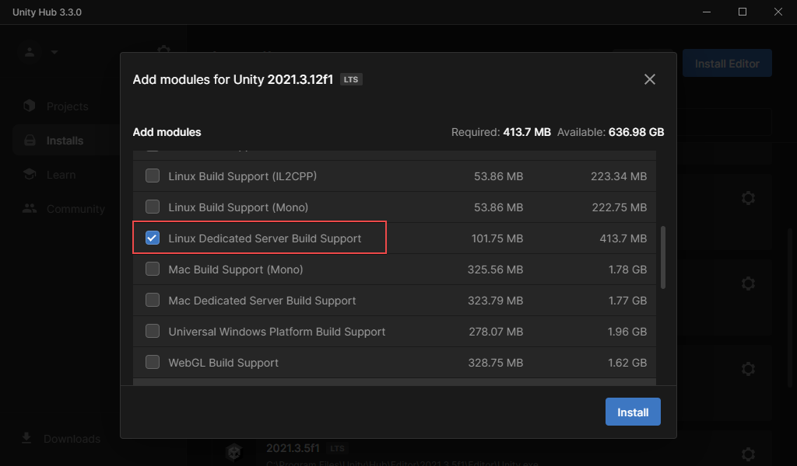
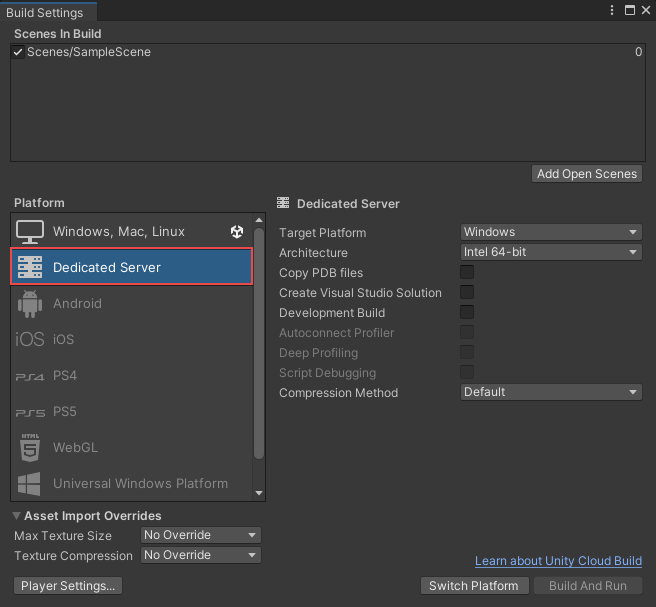
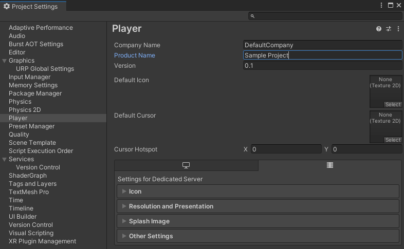

The Dedicated Server [build target](https://docs.unity3d.com/ScriptReference/BuildTarget.html) is a sub-target of the three Desktop Platforms (Linux, macOS, and Windows) that’s optimized for running as a dedicated server. 

Server builds often contain unnecessary assets and compiled code for headless server processes. This data might include artifacts such as audio files, textures, meshes, and shaders. In a multiplayer context, rendering and asset management processes occur unnecessarily when building and executing server runtimes.

The goal of the Dedicated Server build target is to reduce the resource demand of server builds, including the disk size, the size in memory, and the CPU usage. It achieves most of the optimizations through [stripping code](https://docs.unity3d.com/Manual/ManagedCodeStripping.html) and assets that aren’t necessary for a server build.

By using the Dedicated Server build target, you can cut back on your server builds' CPU, memory, and disk space requirements.

### Requirements

You must meet the following requirements to use the Dedicated Server build target.

1. Download and install Unity Editor version **2021.3 LTS** or later
2. Install the Dedicated Server module for the platform you’re targeting. For example, enable **Linux Dedicated Server Build Support** if you plan to build for Linux.



### Get started

You can create a Dedicated Server build through the [Unity Editor user interface](#unity-editor), with [scripts](#scripting), or through the [command line](#command-line).

#### Unity Editor

To create a Dedicated Server build through the Unity Editor:

1. From the Unity Editor, select **File** > **Build Settings…**
2. Select **Dedicated Server**.



:::tip
**Tip**: You can further configure the Dedicated Server build through the Player Settings.
:::

#### Scripting

To create a Dedicated Server build through a script:

Set `buildPlayerOptions.subtarget` to `(int)StandaloneBuildSubtarget.Server`. See the following code snippet for an example.


```csharp
buildPlayerOptions.target = BuildTarget.StandaloneWindows;
// SubTarget expects an integer.
buildPlayerOptions.subtarget = (int)StandaloneBuildSubtarget.Server;
```

See [Creating and Using Scripts](https://docs.unity3d.com/Manual/CreatingAndUsingScripts.html) to learn more.

#### Command line

To create a Dedicated Server build through the command line, use the `-standaloneBuildSubtarget Server` [argument](https://docs.unity3d.com/Manual/CommandLineArguments.html). See the following code snippet for an example.

```bash
-buildTarget Linux64 -standaloneBuildSubtarget Server
```

### Optimizations

This section describes the optimizations of the Dedicated Server build target for networked applications. The Dedicated Server build target applies some optimizations automatically by default, while others are optional because their impact depends on the game's implementation. 

#### Automatic optimizations

By default, the Dedicated Server build target performs the following optimizations:

* [Disables the Audio Subsystem](#audio-subsystem)
* [Removes lighting threads](#lighting-threads)
* [Removes some player loop callbacks](#player-loop-callbacks)
* [Removes GPU-only assets](#gpu-only-assets)

##### Audio Subsystem

The Dedicated Server build target disables the [Audio](https://docs.unity3d.com/Manual/AudioOverview.html) [Subsystem](https://docs.unity.cn/Documentation/ScriptReference/Subsystem.html) because builds don’t need audio support when running as a dedicated server. Disabling the Audio Subsystem reduces CPU load.

##### Lighting threads

The Dedicated Server build target removes process threads related to lighting because there’s no need to render lighting on a server build.

##### Player loop callbacks

The Dedicated Server build target disables the following [PlayerLoop callbacks](https://docs.unity3d.com/ScriptReference/LowLevel.PlayerLoop.html) because they aren’t necessary for a server build.

* Player update loop registration of [`SendMouseEvents`](https://docs.unity3d.com/ScriptReference/PlayerLoop.PreUpdate.SendMouseEvents.html)
* Player update loop registration of [`UpdateAllRenderers`](https://docs.unity3d.com/ScriptReference/PlayerLoop.PostLateUpdate.UpdateAllRenderers.html)
* Player update loop registration of [`PlayerUpdateCanvases`](https://docs.unity3d.com/ScriptReference/PlayerLoop.PostLateUpdate.PlayerUpdateCanvases.html)

##### GPU-only assets

The Dedicated Server build target removes GPU-only assets that the server doesn’t need, such as texture pixel data for textures and mesh vertex data, while preserving assets with CPU Read/Write access and assets in the [Resource Folders](https://docs.unity3d.com/Manual/LoadingResourcesatRuntime.html).

Textures and meshes imported with CPU Read/Write access disabled are only accessible by the GPU; the CPU can't access them. Because the Dedicated Server build target doesn’t initialize a graphics device, there’s no need to include this data. Excluding this data reduces the memory usage of the executable.

See the following lists to learn more about which assets the Dedicated Server build target removes and preserves.

**Removed**:

* Textures with CPU Read/Write access disabled.
* Vertex data for meshes with CPU Read/Write access disabled.

**Preserved**:

* Textures with CPU Read/Write access enabled.
* Vertex data for meshes with CPU Read/Write access enabled.
* Assets in the protected [Resource Folders](https://docs.unity3d.com/Manual/LoadingResourcesatRuntime.html).
* Texture [metadata](https://docs.unity3d.com/Manual/AssetMetadata.html) (such as the texture size value).
* Mesh data that internal systems that run on the CPU require (such as [physics](https://docs.unity3d.com/Manual/PhysicsSection.html)), even if CPU Read/Write is disabled.

:::note
**Note**: To learn more about CPU Read/Write access, see [Texture.isReadable](https://docs.unity3d.com/ScriptReference/Texture-isReadable.html) and [Mesh.isReadable](https://docs.unity3d.com/ScriptReference/Mesh-isReadable.html).
:::

#### More optimizations

In addition to the automatic optimizations applied through the Dedicated Server build target, you can apply the following implementation-specific optimizations manually.

* Use [conditional compilation](https://docs.unity3d.com/Manual/PlatformDependentCompilation.html) to selectively include and exclude code depending on the build target.
* Separation of player-specific and server-specific code through class implementations.
* Remove additional items from the PlayerLoop in server builds. See [PlayerLoop](https://docs.unity3d.com/ScriptReference/LowLevel.PlayerLoop.html) and [PlayerLoopSystem](https://docs.unity3d.com/ScriptReference/LowLevel.PlayerLoopSystem.html).

See [Understanding optimization in Unity](https://docs.unity3d.com/Manual/BestPracticeUnderstandingPerformanceInUnity.html) to learn more.

### Dedicated Server Player Settings

The [player settings](https://docs.unity3d.com/Manual/class-PlayerSettings.html) for the Dedicated Server player are a subset of the Desktop target player settings. That said, due to its headless and server application nature, the following options don't apply:

* Icon
* Resolution and Presentation
* [Splash Image](https://docs.unity3d.com/Manual/class-PlayerSettingsSplashScreen.html)
* Publishing Settings

To customize the Dedicated Server Player Settings:

1. From the Unity Editor, select **File** > **Build Settings…**
2. Select **Player Settings…** 



### AssetBundles

You can also apply the Dedicated Server optimizations to AssetBundle starting in Unity Editor version **2023.1.0a21**. You can old build an AssetBundle through scripting; see the section on AssetBundle for more information on building AssetBundle in general.

To build an AssetBundle to undergo the same Dedicated Server optimizations as discussed for the player, specify the `subtarget` field in the `BuildAssetBundlesParameters` struct to be `StandaloneBuildSubtarget.Server` when calling the `BuildAssetBundle` method. See the following example:

```csharp
BuildAssetBundlesParameters serverAssetBundleParameters =
{
	outputPath = /*some example asset path here, not entirely relevant*/,
	options = BuildAssetBundleOptions.None,
	targetPlatform = BuildTarget.StandaloneWindows64,  //alternately, the MacOS or Linux build targets, any desktop platform
	subtarget = StandaloneBuildSubtarget.Server
};
BuildPipeline.BuildAssetBundles(serverAssetBundleParameters);
```

After you build the AssetBundle has, you can load it by a player at runtime (see [Using AssetBundles Natively](https://docs.unity3d.com/2023.1/Documentation/Manual/AssetBundles-Native.html)).

:::warning
**Known issue**: While the AssetBundle loading process checks if the AssetBundle target platform matches the target platform of the player, it doesn't check the AssetBundle subtarget. Take care to not load an AssetBundle that was built for a non-server standalone player doesn't try to load an AssetBundle that targets the dedicated server subtarget (or vice-versa).
:::

### Desktop Headless Mode

The Dedicated Server build target is similar to the Desktop Headless Mode build target, except it’s optimized to increase memory and CPU performance when running as a networked application. Desktop Headless Mode is a sub-target for any Desktop Platform target that doesn’t initialize a graphics device by passing the `-batchmode` and `-nographics` command line arguments when executing the player. That said, it doesn’t perform any optimizations for running a build as a dedicated server.

Although the Dedicated Server build option performs additional optimizations, you might still want to use Desktop Headless Mode for other purposes, such as automated testing on CI/CD platforms. You can do so by passing the `-batchmode` and `-nographics` command line arguments when executing the player or selecting Headless Mode as a build target in the Unity Editor.

You can’t select Headless Mode from the Unity Editor Build Settings, but you can add the `-batchmode` and `-nographics` command line arguments to effectively create a headless build.

### Next steps

Visit the following resources to learn more about performance optimization in Unity:

* [Games Focus: Profiling and performance optimization](https://blog.unity.com/technology/games-focus-profiling-and-performance-optimization)
* [Optimizations Tips for Unity UI](https://unity.com/how-to/unity-ui-optimization-tips)
* [Best Practices for Performance Optimization in Unity](https://unity.com/how-to/best-practices-performance-optimization-unity)
* [Understanding optimization in Unity](https://docs.unity3d.com/Manual/BestPracticeUnderstandingPerformanceInUnity.html)